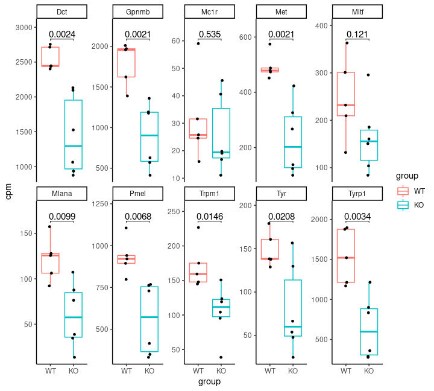

Analysis bulk RNAseq data
================
Kaspar Bresser
20/10/2021

-   [Organs at steady state](#organs-at-steady-state)
    -   [Subset and tidy data](#subset-and-tidy-data)
    -   [PCA](#pca)
    -   [Heatmap](#heatmap)
-   [DE analysis CD45-negative cells](#de-analysis-cd45-negative-cells)
    -   [Subset and tidy](#subset-and-tidy)
    -   [DGE testing](#dge-testing)
    -   [Volcano plot](#volcano-plot)
    -   [Gene-sets](#gene-sets)
    -   [stringDB analysis](#stringdb-analysis)
-   [Clustering analysis](#clustering-analysis)
    -   [Heatmap](#heatmap-1)
    -   [StringDB cluster 2](#stringdb-cluster-2)

Below are all analyses I performed for the bulk RNAseq data from the
manuscript. RNAseq data was obtained from several organs at steady
state, plus the FACS sorted CD45-negative compartment of established
B16F10 tumors.

Reads were aligned to the pre-built GRCm38 genome_snp_tran reference
using HISAT250, and transcript counts were obtained using an in-house
generated pipeline [GenSum](https://github.com/NKI-GCF/gensum)

Import the required packages

Import the RNAseq dataframe. All samples are in this table.

``` r
(rna.data <- read_tsv(file = "./Data/all_gene_counts_bulkRNA_QPCTL.tsv", col_types = cols(chromosome_name = "c")))
```

    ## # A tibble: 55,487 × 55
    ##    ensembl_gene_id    Sample_6362_1_LN1 Sample_6362_2_LN2 Sample_6362_3_LN3
    ##    <chr>                          <dbl>             <dbl>             <dbl>
    ##  1 <NA>                               0                 0                 0
    ##  2 ENSMUSG00000064842                 0                 0                 0
    ##  3 ENSMUSG00000051951                 0                 0                 0
    ##  4 ENSMUSG00000102851                 0                 0                 0
    ##  5 ENSMUSG00000103377                 0                 0                 0
    ##  6 ENSMUSG00000104017                 0                 0                 0
    ##  7 ENSMUSG00000103025                 0                 0                 0
    ##  8 ENSMUSG00000089699                 0                 0                 0
    ##  9 ENSMUSG00000103201                 0                 0                 0
    ## 10 ENSMUSG00000103147                 0                 0                 0
    ## # … with 55,477 more rows, and 51 more variables: Sample_6362_4_LN4 <dbl>,
    ## #   Sample_6362_5_LN5 <dbl>, Sample_6362_6_LN6 <dbl>, Sample_6362_7_LN7 <dbl>,
    ## #   Sample_6362_8_LN8 <dbl>, Sample_6362_9_Spleen1 <dbl>,
    ## #   Sample_6362_10_Spleen2 <dbl>, Sample_6362_11_Spleen3 <dbl>,
    ## #   Sample_6362_12_Spleen4 <dbl>, Sample_6362_13_Spleen5 <dbl>,
    ## #   Sample_6362_14_Spleen6 <dbl>, Sample_6362_15_Spleen7 <dbl>,
    ## #   Sample_6362_16_Spleen8 <dbl>, Sample_6362_17_BM1 <dbl>, …

``` r
names(rna.data)
```

    ##  [1] "ensembl_gene_id"        "Sample_6362_1_LN1"      "Sample_6362_2_LN2"     
    ##  [4] "Sample_6362_3_LN3"      "Sample_6362_4_LN4"      "Sample_6362_5_LN5"     
    ##  [7] "Sample_6362_6_LN6"      "Sample_6362_7_LN7"      "Sample_6362_8_LN8"     
    ## [10] "Sample_6362_9_Spleen1"  "Sample_6362_10_Spleen2" "Sample_6362_11_Spleen3"
    ## [13] "Sample_6362_12_Spleen4" "Sample_6362_13_Spleen5" "Sample_6362_14_Spleen6"
    ## [16] "Sample_6362_15_Spleen7" "Sample_6362_16_Spleen8" "Sample_6362_17_BM1"    
    ## [19] "Sample_6362_18_BM2"     "Sample_6362_19_BM3"     "Sample_6362_20_BM4"    
    ## [22] "Sample_6362_21_BM5"     "Sample_6362_22_BM6"     "Sample_6362_23_BM7"    
    ## [25] "Sample_6362_24_BM8"     "Sample_6362_25_LN9"     "Sample_6362_26_LN10"   
    ## [28] "Sample_6362_27_LN11"    "Sample_6362_28_LN12"    "Sample_6362_29_LN13"   
    ## [31] "Sample_6362_30_LN14"    "Sample_6362_31_LN15"    "Sample_6362_32_LN16"   
    ## [34] "Sample_6362_33_LN17"    "Sample_6362_34_LN18"    "Sample_6362_35_LN19"   
    ## [37] "Sample_6362_36_LN20"    "Sample_6362_37_Tum01"   "Sample_6362_38_Tum02"  
    ## [40] "Sample_6362_39_Tum03"   "Sample_6362_40_Tum04"   "Sample_6362_41_Tum05"  
    ## [43] "Sample_6362_42_Tum06"   "Sample_6362_43_Tum07"   "Sample_6362_44_Tum08"  
    ## [46] "Sample_6362_45_Tum09"   "Sample_6362_46_Tum10"   "Sample_6362_47_Tum11"  
    ## [49] "Sample_6362_48_Tum12"   "gene_biotype"           "chromosome_name"       
    ## [52] "start_position"         "end_position"           "external_gene_id"      
    ## [55] "description"

## Organs at steady state

### Subset and tidy data

Lets first take a look at the transcriptomes of the organs at steady
state. Select those columns, plus the external gene identifier, and
remove rows that contain `NA`.

``` r
rna.data %>% 
  dplyr::select( c(contains(c( "external_gene_id")), 2:25) ) %>% 
  na.omit() -> steady.state.data 

steady.state.data
```

    ## # A tibble: 55,486 × 25
    ##    external_gene_id Sample_6362_1_LN1 Sample_6362_2_LN2 Sample_6362_3_LN3
    ##    <chr>                        <dbl>             <dbl>             <dbl>
    ##  1 Gm26206                          0                 0                 0
    ##  2 Xkr4                             0                 0                 0
    ##  3 Gm18956                          0                 0                 0
    ##  4 Gm37180                          0                 0                 0
    ##  5 Gm37363                          0                 0                 0
    ##  6 Gm37686                          0                 0                 0
    ##  7 Gm1992                           0                 0                 0
    ##  8 Gm37329                          0                 0                 0
    ##  9 Gm7341                           0                 0                 0
    ## 10 Gm38148                          0                 0                 0
    ## # … with 55,476 more rows, and 21 more variables: Sample_6362_4_LN4 <dbl>,
    ## #   Sample_6362_5_LN5 <dbl>, Sample_6362_6_LN6 <dbl>, Sample_6362_7_LN7 <dbl>,
    ## #   Sample_6362_8_LN8 <dbl>, Sample_6362_9_Spleen1 <dbl>,
    ## #   Sample_6362_10_Spleen2 <dbl>, Sample_6362_11_Spleen3 <dbl>,
    ## #   Sample_6362_12_Spleen4 <dbl>, Sample_6362_13_Spleen5 <dbl>,
    ## #   Sample_6362_14_Spleen6 <dbl>, Sample_6362_15_Spleen7 <dbl>,
    ## #   Sample_6362_16_Spleen8 <dbl>, Sample_6362_17_BM1 <dbl>, …

Next, trash rows that have no reads, and in case of double gene_ids,
select the one with the highest read-count

``` r
steady.state.data %>% 
  mutate(sum_counts = rowSums(dplyr::select(.,2:25)) ) %>% 
  filter(sum_counts > 0 ) %>% 
  group_by(external_gene_id) %>%
  top_n(1, sum_counts) -> steady.state.data

steady.state.data
```

    ## # A tibble: 24,324 × 26
    ## # Groups:   external_gene_id [24,324]
    ##    external_gene_id Sample_6362_1_LN1 Sample_6362_2_LN2 Sample_6362_3_LN3
    ##    <chr>                        <dbl>             <dbl>             <dbl>
    ##  1 Gm37180                          0                 0                 0
    ##  2 Sox17                            1                 3                 0
    ##  3 Gm37587                          1                 0                 1
    ##  4 Gm6085                           0                 0                 0
    ##  5 Gm6123                           1                 1                 2
    ##  6 Mrpl15                           1                 2                 1
    ##  7 Lypla1                           0                 3                 0
    ##  8 Tcea1                            0                 2                 1
    ##  9 Gm6104                           0                 0                 2
    ## 10 Gm37277                          1                 1                 1
    ## # … with 24,314 more rows, and 22 more variables: Sample_6362_4_LN4 <dbl>,
    ## #   Sample_6362_5_LN5 <dbl>, Sample_6362_6_LN6 <dbl>, Sample_6362_7_LN7 <dbl>,
    ## #   Sample_6362_8_LN8 <dbl>, Sample_6362_9_Spleen1 <dbl>,
    ## #   Sample_6362_10_Spleen2 <dbl>, Sample_6362_11_Spleen3 <dbl>,
    ## #   Sample_6362_12_Spleen4 <dbl>, Sample_6362_13_Spleen5 <dbl>,
    ## #   Sample_6362_14_Spleen6 <dbl>, Sample_6362_15_Spleen7 <dbl>,
    ## #   Sample_6362_16_Spleen8 <dbl>, Sample_6362_17_BM1 <dbl>, …

Simplify the column names.

``` r
steady.state.data %>% 
  setNames(str_remove(names(.), "\\d+$")) %>% 
  setNames(str_replace(names(.), "Sample_6362_", "S")) %>% 
  column_to_rownames("external_gene_id") -> steady.state.data

head(steady.state.data)
```

    ##         S1_LN S2_LN S3_LN S4_LN S5_LN S6_LN S7_LN S8_LN S9_Spleen S10_Spleen
    ## Gm37180     0     0     0     0     0     0     0     0         0          0
    ## Sox17       1     3     0     0     0     0     0     0         0          4
    ## Gm37587     1     0     1     0     1     0     3     3         0          0
    ## Gm6085      0     0     0     0     0     0     0     0         0          0
    ## Gm6123      1     1     2     0     0     1     0     2         1          0
    ## Mrpl15      1     2     1     3     0     1     0     0         3          5
    ##         S11_Spleen S12_Spleen S13_Spleen S14_Spleen S15_Spleen S16_Spleen
    ## Gm37180          0          0          0          0          0          1
    ## Sox17            1          1          0          0          0          0
    ## Gm37587          0          0          0          0          1          1
    ## Gm6085           0          0          0          0          0          0
    ## Gm6123           0          1          0          0          1          0
    ## Mrpl15          14          5          7          7          5          1
    ##         S17_BM S18_BM S19_BM S20_BM S21_BM S22_BM S23_BM S24_BM sum_counts
    ## Gm37180      0      0      0      0      0      0      0      0          1
    ## Sox17        0      0      0      0      0      0      0      0         10
    ## Gm37587      0      0      0      0      0      0      0      0         11
    ## Gm6085       0      0      0      0      1      0      0      0          1
    ## Gm6123       0      0      1      0      0      0      0      0         11
    ## Mrpl15       5      4     10     14     10      6      1      3        108

Use the `EdgeR` package to get a counts per million table.

``` r
DGE.object <- DGEList(counts = steady.state.data[1:24], 
                      genes = rownames(steady.state.data))

countsPerMillion <- as.data.frame(cpm(DGE.object) )
```

### PCA

Lets look at the variance between the samples using a PCA. We estimate
the variance for each row in the matrix and select the 1000 most
variable genes

``` r
var_genes <- apply(countsPerMillion, 1, var)
head(var_genes)
```

    ##    Gm37180      Sox17    Gm37587     Gm6085     Gm6123     Mrpl15 
    ##  0.8669949  5.9948365  9.9526382  0.1023688  5.1073662 80.9079369

``` r
select_var <- names(sort(var_genes, decreasing=TRUE))[1:1000]
countsPerMillion <- countsPerMillion[select_var, ]
```

Perform PCA using these genes.

``` r
countsPerMillion %>% 
  t() %>% 
  as.data.frame() %>% 
  prcomp(center = T, scale = T) -> pca

str(pca)
```

    ## List of 5
    ##  $ sdev    : num [1:24] 21.06 14.42 11.51 7.05 5.84 ...
    ##  $ rotation: num [1:1000, 1:24] -0.0396 0.0387 -0.0126 -0.0428 -0.0126 ...
    ##   ..- attr(*, "dimnames")=List of 2
    ##   .. ..$ : chr [1:1000] "mt-Nd6" "Gm11505" "Ube2c" "Gm20721" ...
    ##   .. ..$ : chr [1:24] "PC1" "PC2" "PC3" "PC4" ...
    ##  $ center  : Named num [1:1000] 21082 6503 2191 26006 1825 ...
    ##   ..- attr(*, "names")= chr [1:1000] "mt-Nd6" "Gm11505" "Ube2c" "Gm20721" ...
    ##  $ scale   : Named num [1:1000] 12830 9222 8700 8287 7144 ...
    ##   ..- attr(*, "names")= chr [1:1000] "mt-Nd6" "Gm11505" "Ube2c" "Gm20721" ...
    ##  $ x       : num [1:24, 1:24] -22.5 -20.9 -25.5 -23.8 -28.2 ...
    ##   ..- attr(*, "dimnames")=List of 2
    ##   .. ..$ : chr [1:24] "S1_LN" "S2_LN" "S3_LN" "S4_LN" ...
    ##   .. ..$ : chr [1:24] "PC1" "PC2" "PC3" "PC4" ...
    ##  - attr(*, "class")= chr "prcomp"

And make the plot.

``` r
as.data.frame(pca$x) %>% 
  mutate(organ = as.factor(c( rep("LN", 8), rep("Spleen", 8), rep("BM", 8) )),
         genotype = as.factor(rep( c("WT","WT","WT","WT","KO","KO","KO","KO"), 3 ))) %>% 
  ggplot(aes(x = PC1, y = PC2, group = organ))+
  geom_point( aes(shape=organ, color=genotype), size = 2 )+
  ggtitle("PCA 1000 most variable genes")+
  theme_classic()
```


``` r
ggsave("./Figs/steady_state_PCA.pdf",  width = 2.5, height = 2, useDingbats = F, scale = 1.5)

pca$x[,c(1,2)] %>% 
  as.data.frame() %>% 
  as_tibble(rownames = "sample") %>% 
  write_tsv( "./Output/steady_state_PCA.tsv")
```

### Heatmap

Get log-transformed CPM values, and select the 250 most variable genes.

``` r
countsPerMillion <- cpm(DGE.object, log = T)

select_var <- names(sort(var_genes, decreasing=TRUE))[1:250]
countsPerMillion <- countsPerMillion[select_var,]
```

Set annotations for the heatmap.

``` r
annotation <- data.frame( organ = as.factor(c( rep("LN", 8), rep("Spleen", 8), rep("BM", 8) )),
                          genotype = as.factor(rep( c("WT","WT","WT","WT","KO","KO","KO","KO"), 3 )) )
rownames(annotation) <- colnames(countsPerMillion) 

annotation
```

    ##             organ genotype
    ## S1_LN          LN       WT
    ## S2_LN          LN       WT
    ## S3_LN          LN       WT
    ## S4_LN          LN       WT
    ## S5_LN          LN       KO
    ## S6_LN          LN       KO
    ## S7_LN          LN       KO
    ## S8_LN          LN       KO
    ## S9_Spleen  Spleen       WT
    ## S10_Spleen Spleen       WT
    ## S11_Spleen Spleen       WT
    ## S12_Spleen Spleen       WT
    ## S13_Spleen Spleen       KO
    ## S14_Spleen Spleen       KO
    ## S15_Spleen Spleen       KO
    ## S16_Spleen Spleen       KO
    ## S17_BM         BM       WT
    ## S18_BM         BM       WT
    ## S19_BM         BM       WT
    ## S20_BM         BM       WT
    ## S21_BM         BM       KO
    ## S22_BM         BM       KO
    ## S23_BM         BM       KO
    ## S24_BM         BM       KO

``` r
pheatmap(countsPerMillion, scale = "row",breaks = seq(-1.5,1.5,by=0.03), 
         clustering_distance_cols = "euclidean" , annotation_col = annotation, show_rownames = F,
         border_color = NA, clustering_distance_rows = "manhattan", main = "250 most variable genes")
```


``` r
countsPerMillion %>% 
  as_tibble(rownames = "gene") %>% 
  write_tsv("./Output/steady_state_heatmap.tsv")
```

## DE analysis CD45-negative cells

### Subset and tidy

filter like above, but now for the CD45-negative samples, sorted from
the tumor samples. These columns are annotated with “Tum”.

Trash rows that have no reads, and in case of double gene_ids, select
the one with the highest read-count.

Simplify column names.

Also remove sample 4, as sequencing quality was very low for this
sample.

``` r
rna.data %>% 
  na.omit() %>% 
  dplyr::select(contains(c("Tum", "external"))) %>% 
  mutate(sum_counts = rowSums(dplyr::select(.,1:12)) ) %>% 
  filter(sum_counts > 0 ) %>% 
  group_by(external_gene_id) %>%
  top_n(1, sum_counts) %>% 
  setNames(str_remove(names(.), "\\d+$")) %>% 
  setNames(gsub(pattern = "Sample_6362_", replacement = "S", x = names(.))) %>% 
  dplyr::select(-S40_Tum) %>% 
  column_to_rownames("external_gene_id") -> tumor.data

head(tumor.data)
```

    ##         S37_Tum S38_Tum S39_Tum S41_Tum S42_Tum S43_Tum S44_Tum S45_Tum S46_Tum
    ## Gm6123        0       0       1       0       2       1       0       0       0
    ## Mrpl15       13      16       7       4      11       2       5       8       1
    ## Lypla1        9       2       7       1       1       2       4       3       1
    ## Tcea1        11       4       8       9       9      10       8       2       2
    ## Gm6104        0       0       0       0       0       0       0       0       0
    ## Gm37277       0       1       0       1       1       0       0       1       1
    ##         S47_Tum S48_Tum sum_counts
    ## Gm6123        0       1          6
    ## Mrpl15        1       4         72
    ## Lypla1        2       2         35
    ## Tcea1         1       0         64
    ## Gm6104        1       1          2
    ## Gm37277       2       0          7

### DGE testing

Create grouping factor for DGE object and make the DGE object.

``` r
group <- factor(c("WT","WT","WT","WT","WT","KO","KO" ,"KO","KO","KO","KO"),levels = c("WT", "KO"))

DGE.object <- DGEList(counts = tumor.data[1:11], 
                      group = group,
                      genes = rownames(tumor.data))
```

Get CPM tranformed reads, make logicle matrix to check cpm threshold at
1.5, and summarize the number of genes that are reliably detected above
this threshold for multiple samples.

``` r
countsPerMillion <- as.data.frame(cpm(DGE.object))

thresh <- countsPerMillion > 1.5
head(thresh)
```

    ##         S37_Tum S38_Tum S39_Tum S41_Tum S42_Tum S43_Tum S44_Tum S45_Tum S46_Tum
    ## Gm6123    FALSE   FALSE    TRUE   FALSE    TRUE    TRUE   FALSE   FALSE   FALSE
    ## Mrpl15     TRUE    TRUE    TRUE    TRUE    TRUE    TRUE    TRUE    TRUE    TRUE
    ## Lypla1     TRUE    TRUE    TRUE    TRUE    TRUE    TRUE    TRUE    TRUE    TRUE
    ## Tcea1      TRUE    TRUE    TRUE    TRUE    TRUE    TRUE    TRUE    TRUE    TRUE
    ## Gm6104    FALSE   FALSE   FALSE   FALSE   FALSE   FALSE   FALSE   FALSE   FALSE
    ## Gm37277   FALSE    TRUE   FALSE    TRUE    TRUE   FALSE   FALSE    TRUE    TRUE
    ##         S47_Tum S48_Tum
    ## Gm6123    FALSE    TRUE
    ## Mrpl15     TRUE    TRUE
    ## Lypla1     TRUE    TRUE
    ## Tcea1      TRUE   FALSE
    ## Gm6104     TRUE    TRUE
    ## Gm37277    TRUE   FALSE

``` r
table(rowSums(thresh))
```

    ## 
    ##    0    1    2    3    4    5    6    7    8    9   10   11 
    ##   91 2684 1343  905  771  712  781  773  997 1298 1832 6440

We will keep genes for which at least 7 samples have \> 1.5 cpm (11340
genes in total)

``` r
summary(rowSums(thresh) >= 7)
```

    ##    Mode   FALSE    TRUE 
    ## logical    7287   11340

``` r
DGE.object <- DGE.object[rowSums(thresh) >= 7, , keep.lib.sizes=FALSE]
```

Prepare for DGE testing.

``` r
# Calculate sample normalization factors
DGE.object <- calcNormFactors(DGE.object)
DGE.object$samples
```

    ##         group lib.size norm.factors
    ## S37_Tum    WT   503857    1.0852684
    ## S38_Tum    WT   308110    1.0921717
    ## S39_Tum    WT   307325    1.1334892
    ## S41_Tum    WT   322975    0.9951546
    ## S42_Tum    WT   345300    1.0210535
    ## S43_Tum    KO   282953    1.0179372
    ## S44_Tum    KO   342388    1.0276815
    ## S45_Tum    KO   207800    1.0305105
    ## S46_Tum    KO   179696    0.9249952
    ## S47_Tum    KO   201151    0.8968505
    ## S48_Tum    KO   295453    0.8190757

``` r
# Set design for comparison
design <- model.matrix(~ 1 + group)

# Estimate dispersions
DGE.object <- estimateDisp(DGE.object, design, robust=TRUE)
```

Sample distance plot

``` r
plotMDS(DGE.object)
```


Perform DE (quasi-likelyhood) test and make MD-plot.

``` r
fit <- glmQLFit(DGE.object, design)
qlf <- glmQLFTest(fit, coef=2)

plotMD(qlf)
```


Get results, perform FDR correction for P values, and write data.

``` r
qlf$table %>% 
  as_tibble(rownames = "gene") %>% 
  mutate(FDR = p.adjust(PValue, method = "fdr")) -> DE.results

DE.results
```

    ## # A tibble: 11,340 × 6
    ##    gene            logFC logCPM         F    PValue    FDR
    ##    <chr>           <dbl>  <dbl>     <dbl>     <dbl>  <dbl>
    ##  1 Mrpl15        -0.865    4.80  4.15     0.0452    0.287 
    ##  2 Lypla1        -0.0917   4.05  0.0287   0.866     0.945 
    ##  3 Tcea1         -0.452    4.67  1.05     0.309     0.634 
    ##  4 Atp6v1h       -1.16     4.63  5.37     0.0232    0.225 
    ##  5 Rb1cc1        -0.710    4.00  1.54     0.218     0.549 
    ##  6 4732440D04Rik -0.0158   3.69  0.000529 0.982     0.993 
    ##  7 Pcmtd1        -0.960    4.19  3.12     0.0814    0.362 
    ##  8 Rrs1           0.0642   5.61  0.0512   0.822     0.928 
    ##  9 Adhfe1        -0.120    3.71  0.0344   0.853     0.938 
    ## 10 2610203C22Rik  1.05     6.58 19.3      0.0000366 0.0170
    ## # … with 11,330 more rows

``` r
write_tsv(x = DE.results, file = "./Output/tumor_DE_results.tsv" )
```

### Volcano plot

annotate significant genes and arrange genes. We’ll mark genes with and
FDR of \< 0.05 and label ones that are \< 0.01

``` r
DE.results %>% 
  mutate(sig =  FDR < 0.05, lab = FDR < 0.01 ) %>% 
  arrange(sig) -> to.plot
```

And make the plot

``` r
ggplot(to.plot, aes( x = logFC, y = log10(FDR), color = sig, label = gene) ) + 
  geom_point()+
  scale_y_reverse()+
  scale_color_manual(values=c("#c0c0c0", "red"))+
  geom_text_repel(data = subset(to.plot, lab == TRUE ),box.padding = 1, max.overlaps = 15 )+
  labs(title = "")+
  theme(legend.position = "none", plot.title = element_text(hjust = 0.5))+
  #  xlim(-0.4,0.6)+
  geom_vline(xintercept = 0, linetype ="dotted")+
  geom_hline(yintercept = log10(0.05), linetype ="dotted")
```


``` r
ggsave("./Figs/tumor_Volcano.pdf",  width = 4, height = 6, useDingbats = F)
```

    ## Warning: ggrepel: 1 unlabeled data points (too many overlaps). Consider
    ## increasing max.overlaps

### Gene-sets

#### Cell cycle

Investigate cell cycle related gene-expression in the data. Download
pathways from MSigDB using the `msigdbr` package.

``` r
pathways <- msigdbr(species = "Mus musculus", category = "H")
```

Join with DE results.

``` r
pathways %>% 
  select(gene_symbol, gs_name) %>% 
  rename(gene = gene_symbol) %>% 
  inner_join(DE.results) -> DE.results.path

DE.results.path
```

    ## # A tibble: 4,731 × 7
    ##    gene    gs_name                  logFC logCPM         F  PValue   FDR
    ##    <chr>   <chr>                    <dbl>  <dbl>     <dbl>   <dbl> <dbl>
    ##  1 Abcb8   HALLMARK_ADIPOGENESIS -0.486     4.54 1.27      0.264   0.598
    ##  2 Acaa2   HALLMARK_ADIPOGENESIS -0.306     3.50 0.179     0.674   0.858
    ##  3 Acadl   HALLMARK_ADIPOGENESIS -0.266     5.38 0.742     0.392   0.696
    ##  4 Acadm   HALLMARK_ADIPOGENESIS -0.398     4.22 0.600     0.441   0.733
    ##  5 Acads   HALLMARK_ADIPOGENESIS -0.508     3.84 0.702     0.405   0.706
    ##  6 Acly    HALLMARK_ADIPOGENESIS -0.515     7.08 5.59      0.0206  0.214
    ##  7 Aco2    HALLMARK_ADIPOGENESIS -0.626     7.29 9.63      0.00271 0.104
    ##  8 Acox1   HALLMARK_ADIPOGENESIS  0.0885    6.20 0.123     0.727   0.887
    ##  9 Adcy6   HALLMARK_ADIPOGENESIS -0.00242   4.29 0.0000196 0.996   0.998
    ## 10 Adipor2 HALLMARK_ADIPOGENESIS -0.183     5.12 0.258     0.613   0.829
    ## # … with 4,721 more rows

Focus on cell cycle related genes, filter for significant genes, and
plot waterfalls.

``` r
paths <- c("HALLMARK_MYC_TARGETS_V1", "HALLMARK_MYC_TARGETS_V2", 
           "HALLMARK_MITOTIC_SPINDLE", "HALLMARK_G2M_CHECKPOINT", 
           "HALLMARK_E2F_TARGETS")

DE.results.path %>% 
  filter(gs_name %in% paths) %>% 
  filter(PValue < 0.05) %>% 
  mutate(gene = reorder_within(x = gene, by = logFC, within = gs_name)) %>% 
    ggplot(aes(x = gene, y = logFC, fill=logFC > 0))+
      geom_bar(stat="identity")+ 
      facet_wrap(~gs_name, scales = "free")+
      coord_flip()+
      scale_x_reordered()+
      theme_minimal()+
      theme(legend.position = "none", plot.title = element_text(hjust = 0.5))+
      scale_fill_manual(values=c("darkblue", "darkred"))
```


``` r
DE.results.path %>% 
  filter(gs_name %in% paths) %>% 
  filter(PValue < 0.05) %>% 
  write_tsv("./Output/tumor_cell_cycle_waterfalls.tsv")
```

Can also calculate signature sums per sample and plot those. First
subset and tidy data.

``` r
countsPerMillion %>% 
  as_tibble(rownames = "gene") %>% 
  inner_join(pathways, by = c("gene" = "gene_symbol")) %>% 
  filter(gs_name %in% paths) %>% 
  pivot_longer(cols = contains("Tum"), names_to = "sample", values_to = "cpm") %>% 
  select(gene, sample, gs_name, cpm) -> cpm.data

cpm.data
```

    ## # A tibble: 9,372 × 4
    ##    gene  sample  gs_name                   cpm
    ##    <chr> <chr>   <chr>                   <dbl>
    ##  1 Cops5 S37_Tum HALLMARK_MYC_TARGETS_V1 31.5 
    ##  2 Cops5 S38_Tum HALLMARK_MYC_TARGETS_V1 19.3 
    ##  3 Cops5 S39_Tum HALLMARK_MYC_TARGETS_V1 12.9 
    ##  4 Cops5 S41_Tum HALLMARK_MYC_TARGETS_V1 27.7 
    ##  5 Cops5 S42_Tum HALLMARK_MYC_TARGETS_V1 23.0 
    ##  6 Cops5 S43_Tum HALLMARK_MYC_TARGETS_V1 14.0 
    ##  7 Cops5 S44_Tum HALLMARK_MYC_TARGETS_V1 23.2 
    ##  8 Cops5 S45_Tum HALLMARK_MYC_TARGETS_V1 19.1 
    ##  9 Cops5 S46_Tum HALLMARK_MYC_TARGETS_V1 11.1 
    ## 10 Cops5 S47_Tum HALLMARK_MYC_TARGETS_V1  4.94
    ## # … with 9,362 more rows

Add grouping and calculate sums.

``` r
cpm.data %>% 
  mutate(group = factor(case_when(sample %in% colnames(countsPerMillion)[1:5] ~ "WT",
                                    TRUE ~ "KO"), 
                        levels = c("WT", "KO"))) %>% 
  group_by(group, sample, gs_name) %>% 
  summarise(signature_sum = sum(cpm)) -> cpm.data

write_tsv(cpm.data, "./Output/tumor_cell_cycle_boxplots.tsv")
```

calculate P values.

``` r
cpm.data %>% 
  group_by(gs_name) %>%
  tukey_hsd(signature_sum ~ group ) %>%
  add_significance("p.adj") %>% 
  add_xy_position(fun = "max", x = "group", dodge = 0.8, scales = "free") %>%
  mutate(p.adj = round(p.adj, 4))  -> stat.test

stat.test
```

    ## # A tibble: 5 × 14
    ##   gs_name      term  group1 group2 null.value estimate conf.low conf.high  p.adj
    ##   <chr>        <chr> <chr>  <chr>       <dbl>    <dbl>    <dbl>     <dbl>  <dbl>
    ## 1 HALLMARK_E2… group WT     KO              0   -2092.   -3602.     -582. 0.0121
    ## 2 HALLMARK_G2… group WT     KO              0   -2189.   -3686.     -691. 0.0091
    ## 3 HALLMARK_MI… group WT     KO              0   -2423.   -4088.     -758. 0.0094
    ## 4 HALLMARK_MY… group WT     KO              0   -5964.  -10704.    -1224. 0.0192
    ## 5 HALLMARK_MY… group WT     KO              0    -466.    -794.     -138. 0.0105
    ## # … with 5 more variables: p.adj.signif <chr>, y.position <dbl>,
    ## #   groups <named list>, xmin <dbl>, xmax <dbl>

And make the plot

``` r
ggplot(cpm.data, aes(x = group, y = signature_sum, color = group))+
  geom_boxplot(outlier.shape = NA)+
  geom_jitter(width = 0.1, color = "black", size = 2)+
  theme(legend.position = "none", plot.title = element_text(hjust = 0.5))+   
  facet_wrap(~gs_name, scale = "free_y", nrow = 2)+
  stat_pvalue_manual(data = stat.test,  label = "p.adj", 
                     tip.length = 0.01,hide.ns = F, label.size = 4 )+
  scale_y_continuous(expand = expansion(mult = c(0.05, 0.15)))+
  theme_classic()
```


#### melanogenisis

Now lets check expression of genes involved in melanogenisis. Filter for
those genes, and tidy data.

``` r
mel.genes <- c("Tyrp1", "Tyr", "Dct", "Mitf", "Trpm1","Met", "Mlana","Pmel", "Gpnmb","Mc1r")

countsPerMillion %>% 
  as_tibble(rownames = "gene") %>% 
  filter(gene %in% mel.genes) %>% 
  pivot_longer(cols = -gene, names_to = "sample", values_to = "cpm") %>% 
  mutate(group = factor(case_when(sample %in% colnames(countsPerMillion)[1:5] ~ "WT",
                                    TRUE ~ "KO"), 
                        levels = c("WT", "KO")))  -> mel.data 

write_tsv(mel.data, "./Output/tumor_melano_boxplots.tsv")
```

Calculate statistics

``` r
mel.data %>% 
  group_by(gene) %>%
  tukey_hsd(cpm ~ group ) %>%
  add_xy_position(fun = "max", x = "group", dodge = 0.8, scales = "free") %>%
  mutate(p.adj = round(p.adj, 4))  -> stat.test

stat.test
```

    ## # A tibble: 10 × 14
    ##    gene  term  group1 group2 null.value estimate conf.low conf.high  p.adj
    ##    <chr> <chr> <chr>  <chr>       <dbl>    <dbl>    <dbl>     <dbl>  <dbl>
    ##  1 Dct   group WT     KO              0 -1114.    -1717.     -510.  0.0024
    ##  2 Gpnmb group WT     KO              0  -900.    -1377.     -423.  0.0021
    ##  3 Mc1r  group WT     KO              0    -5.92    -26.7      14.8 0.535 
    ##  4 Met   group WT     KO              0  -264.     -403.     -124.  0.0021
    ##  5 Mitf  group WT     KO              0   -84.2    -195.       26.9 0.121 
    ##  6 Mlana group WT     KO              0   -62.2    -105.      -19.0 0.0099
    ##  7 Pmel  group WT     KO              0  -372.     -614.     -131.  0.0068
    ##  8 Trpm1 group WT     KO              0   -65.5    -115.      -16.3 0.0146
    ##  9 Tyr   group WT     KO              0   -69.1    -125.      -13.2 0.0208
    ## 10 Tyrp1 group WT     KO              0  -889.    -1401.     -378.  0.0034
    ## # … with 5 more variables: p.adj.signif <chr>, y.position <dbl>,
    ## #   groups <named list>, xmin <dbl>, xmax <dbl>

And plot

``` r
ggplot(mel.data, aes(x = group, y = cpm))+
  geom_boxplot(aes(color = group), outlier.shape = NA)+
  geom_jitter(width = 0.05, color = "black", size = 1)+
  facet_wrap(~gene, nrow = 2, scales = "free_y")+
  stat_pvalue_manual(data = stat.test,  label = "p.adj", 
                     tip.length = 0.01,hide.ns = F, label.size = 4 )+
  scale_y_continuous(expand = expansion(mult = c(0.05, 0.15)))+
  theme_classic()
```



### stringDB analysis

Finally, we can check if there are any interesting gene-networks in our
DE data, I’ll do this by querying the [stringDB](https://string-db.org).

Will use `httr` package to query stringDB.

Set up parameters needed for query

``` r
#Species ID, mouse is 10090, human is 9606
species <- "10090"

# set-up genes to search
DE.results %>% 
  filter(FDR < 0.05) %>% 
  pull(gene) -> genes

# number of maximum nodes to return
n.nodes <- 25
```

paste genes to search together and make API

``` r
genes.search <- paste0(genes, collapse = "%0d")
api <- paste0("https://string-db.org/api/tsv/network?identifiers=", genes.search,"&species=",species , collapse = "")

api
```

    ## [1] "https://string-db.org/api/tsv/network?identifiers=2610203C22Rik%0dMterf4%0dTeddm2%0dSoat1%0dTraf3ip3%0dGm32926%0dGm30346%0d4930404N11Rik%0d1810014B01Rik%0dDnajc14%0dOgdh%0dUgp2%0dGm10425%0dGm40578%0dAkt1%0dLgals3%0dDct%0dOxct1%0dFzd6%0dSt3gal1%0dGm16537%0dGalnt6os%0dMapk1%0dTfrc%0d9530082P21Rik%0dMlst8%0dEme2%0dStub1%0dGgnbp1%0dGm20496%0dGm16172%0dBysl%0dGm50087%0dSyt4%0dTxnl1%0dAtp5a1%0dScd2%0dAcvr2a%0dRapgef2%0dPsmb4%0dAtp1a1%0dGbp5%0dSdcbp%0dTyrp1%0dLuzp1%0dGm43808%0dArt3%0dTctn1%0d4932422M17Rik%0dMet%0dGpnmb%0dMalsu1%0dGm43292%0dWdr54%0dAtg7%0dFbxo46%0dPsmd8%0dGpi1%0dFtl1%0dLdha%0dRps3%0dGm45205%0dBnip3%0dGm15655%0dTpm1%0d5830418P13Rik%0dCtnnb1%0dmt-Rnr1%0dmt-Nd6%0dSlc25a5%0dAtrx%0dCox7b%0dPgk1&species=10090"

Store search in vector and extract content

``` r
stringDB.results <- GET(api)
stringDB.results <- content(stringDB.results)

stringDB.results
```

    ## # A tibble: 118 × 13
    ##    stringId_A    stringId_B    preferredName_A preferredName_B ncbiTaxonId score
    ##    <chr>         <chr>         <chr>           <chr>                 <dbl> <dbl>
    ##  1 10090.ENSMUS… 10090.ENSMUS… Akt1            Pgk1                  10090 0.428
    ##  2 10090.ENSMUS… 10090.ENSMUS… Akt1            Pgk1                  10090 0.428
    ##  3 10090.ENSMUS… 10090.ENSMUS… Akt1            Lgals3                10090 0.535
    ##  4 10090.ENSMUS… 10090.ENSMUS… Akt1            Lgals3                10090 0.535
    ##  5 10090.ENSMUS… 10090.ENSMUS… Akt1            Tfrc                  10090 0.569
    ##  6 10090.ENSMUS… 10090.ENSMUS… Akt1            Tfrc                  10090 0.569
    ##  7 10090.ENSMUS… 10090.ENSMUS… Akt1            Bnip3                 10090 0.641
    ##  8 10090.ENSMUS… 10090.ENSMUS… Akt1            Bnip3                 10090 0.641
    ##  9 10090.ENSMUS… 10090.ENSMUS… Akt1            Ldha                  10090 0.664
    ## 10 10090.ENSMUS… 10090.ENSMUS… Akt1            Ldha                  10090 0.664
    ## # … with 108 more rows, and 7 more variables: nscore <dbl>, fscore <dbl>,
    ## #   pscore <dbl>, ascore <dbl>, escore <dbl>, dscore <dbl>, tscore <dbl>

``` r
write_tsv(stringDB.results, "./Output/tumor_DEgenes_stringDB.tsv")
```

Reshape data to obtain a two-column tibble containing the linkage.

``` r
stringDB.results %>% 
  mutate(link_id = 1:n()) %>% 
  dplyr::select(contains(c("string", "preferred")), link_id) %>% 
  pivot_longer(cols = -link_id, names_to = "ID", values_to = "gene") %>% 
  separate(col = ID, into = c("ID", "link")) %>% 
  pivot_wider(names_from = ID, values_from = gene) %>% 
  transmute(stringID = stringId, GeneID = preferredName) %>% 
  distinct() -> linkage

linkage
```

    ## # A tibble: 36 × 2
    ##    stringID                 GeneID
    ##    <chr>                    <chr> 
    ##  1 10090.ENSMUSP00000001780 Akt1  
    ##  2 10090.ENSMUSP00000080302 Pgk1  
    ##  3 10090.ENSMUSP00000114350 Lgals3
    ##  4 10090.ENSMUSP00000023486 Tfrc  
    ##  5 10090.ENSMUSP00000101718 Bnip3 
    ##  6 10090.ENSMUSP00000103267 Ldha  
    ##  7 10090.ENSMUSP00000111103 Met   
    ##  8 10090.ENSMUSP00000032457 Atg7  
    ##  9 10090.ENSMUSP00000040431 Stub1 
    ## 10 10090.ENSMUSP00000065983 Mapk1 
    ## # … with 26 more rows

Extract the edges, and create the net using the `igraph` package

``` r
stringDB.results %>% 
  dplyr::select(stringId_A, stringId_B, score) -> edges.plot


net <- graph_from_data_frame(d = edges.plot, 
                             vertices = linkage, 
                             directed = T)
class(net)
```

    ## [1] "igraph"

Now create a color vector based on the DE results to use with the net.

``` r
values <- DE.results$logFC

# set colors
# Use n equally spaced breaks to assign each value to n-1 equal sized bins 
ii <- cut(values, breaks = seq(min(values), max(values), len = 100), 
          include.lowest = TRUE)

# Use bin indices, ii, to select color from vector of n-1 equally spaced colors
colors <- colorRampPalette(rev(brewer.pal(n = 7, name = "RdYlBu")))(99)[ii]

str(colors)
```

    ##  chr [1:11340] "#D3EAF3" "#EFF9DA" "#E6F5EC" "#BADAEA" "#DCF0F6" "#F1F9D7" ...

Then add gene names and filter the color vector for genes that are in
the network (i.e. in the linkage table)

``` r
# add gene names to color vector
names(colors) <- DE.results$gene

# check if anything is not included and add the as grey colors
setdiff(linkage$GeneID, DE.results$gene)
```

    ## [1] "Mterfd2"

``` r
(not.included <- setdiff(linkage$GeneID, DE.results$gene))
```

    ## [1] "Mterfd2"

``` r
to.add <- rep("darkgrey", length(not.included))
names(to.add) <- not.included
colors <- c(colors, to.add)

# Only keep colors that are in the linkage, i.e. in the Net
colors <- (colors[names(colors) %in% linkage$GeneID])

# Sort colors to match net
colors <- colors[V(net)$GeneID]


colors
```

    ##       Akt1       Pgk1     Lgals3       Tfrc      Bnip3       Ldha        Met 
    ##  "#D7EDF5"  "#D7EDF5"  "#B6D7E8"  "#BFDDEC"  "#BADAEA"  "#D7EDF5"  "#CEE7F1" 
    ##       Atg7      Stub1      Mapk1      Mlst8     Ctnnb1       Ogdh       Gpi1 
    ##  "#FEF7B3"  "#FEF7B3"  "#B1D4E6"  "#FEE496"  "#DCF0F6"  "#BFDDEC"  "#DCF0F6" 
    ##     Atp5a1      Psmb4      Txnl1      Psmd8      Tyrp1      Gpnmb        Dct 
    ##  "#D3EAF3"  "#A2CAE1"  "#99C4DD"  "#B6D7E8"  "#BFDDEC"  "#D3EAF3"  "#DCF0F6" 
    ##       Atrx      Sdcbp     Acvr2a       Fzd6    Rapgef2    Slc25a5       Ftl1 
    ##  "#D7EDF5"  "#CEE7F1"  "#FEF1AA"  "#D73027"  "#C4E0ED"  "#C4E0ED"  "#D3EAF3" 
    ##       Bysl       Rps3      Oxct1      Cox7b    Mterfd2     Malsu1     Atp1a1 
    ##  "#FEF9B6"  "#D7EDF5"  "#CEE7F1"  "#BFDDEC" "darkgrey"  "#FEE699"  "#E0F3F6" 
    ##       Ugp2 
    ##  "#C4E0ED"

Now we can plot the network.

``` r
# set colors to the Net
V(net)$color <- colors

# scale edges
E(net)$width <- E(net)$score * 6


plot(net, edge.arrow.size=0,vertex.label = V(net)$GeneID, vertex.size = 15,
     vertex.label.color = "black", vertex.label.font = 2,vertex.label.cex = .9,
     layout=layout_with_fr, edge.curved=0, )
```


## Clustering analysis

### Heatmap

Instead of looking at the DE data, we can also perform a clustering
analysis on the RNAseq data, and see if we find anything there

Get a log-transformed cpm table form the DGE object, and select the top
250 most variable genes.

``` r
cpm.table <- as.data.frame(cpm(DGE.object, log = T))

var.genes <- apply(cpm.table, 1, var)

select.var <- names(sort(var.genes, decreasing=TRUE))[1:250]
cpm.table <- cpm.table[select.var,]
```

perform hierarchical clustering.

``` r
cpm.table %>% 
  # transpose the matrix so genes are as columns
  t() %>% 
  # apply scaling to each column of the matrix (genes)
  scale() %>% 
  # transpose back so genes are as rows again
  t() %>% 
  dist() %>% 
  hclust(method = "complete") -> gene.hclust

plot(gene.hclust, labels = FALSE)
```


There appear to be 4 main clusters. Use these to create row annotations
for the heatmap.

``` r
cutree(gene.hclust, k = 4) %>% 
  enframe() %>% 
  transmute(gene = name, cluster = as.factor(value)) %>% 
  column_to_rownames("gene") -> gene.cluster
```

Set column annotations for heatmap

``` r
annotation <- data.frame( genotype = c(rep("WT", 5),rep("KO", 6)) )
rownames(annotation) <- colnames(cpm.table)

annotation
```

    ##         genotype
    ## S37_Tum       WT
    ## S38_Tum       WT
    ## S39_Tum       WT
    ## S41_Tum       WT
    ## S42_Tum       WT
    ## S43_Tum       KO
    ## S44_Tum       KO
    ## S45_Tum       KO
    ## S46_Tum       KO
    ## S47_Tum       KO
    ## S48_Tum       KO

And make the heatmap.

``` r
pheatmap(cpm.table, scale = "row",breaks = seq(-1.5,1.5,by=0.03), 
         clustering_distance_cols = "euclidean" , annotation_col = annotation, show_rownames = F,
         border_color = NA, cutree_rows = 4, annotation_row = gene.cluster)
```


### StringDB cluster 2

Cluster 2 appears enriched in KO tumors. Lets perform a string query for
those genes

``` r
gene.cluster %>% 
  rownames_to_column("gene") %>% 
  filter(cluster == 2) %>% 
  pull(gene) -> genes
```

paste genes to search together and make API

``` r
genes.search <- paste0(genes, collapse = "%0d")
api <- paste0("https://string-db.org/api/tsv/network?identifiers=", genes.search,"&species=",species , collapse = "")

api
```

    ## [1] "https://string-db.org/api/tsv/network?identifiers=Gm20496%0dFzd6%0dG530012D18Rik%0dMir6381%0dGm15821%0dGm17334%0dPsmb9%0dGbp7%0dGm17017%0dGbp5%0dGm19412%0dGbp4%0dGm11626%0dAlg3%0dGbp2%0dGm11131%0dGm43198%0dCcdc8%0dGm47248%0dCyren%0dIigp1%0dGm15657%0dGm49774%0dTex13b%0dPirb%0d4933423P22Rik%0dGm46637%0dIgtp%0dC78334%0dGm15425%0dIrf1%0dPycard%0dTap1&species=10090"

Store search in vector and extract content

``` r
stringDB.results <- GET(api)
stringDB.results <- content(stringDB.results)

stringDB.results
```

    ## # A tibble: 64 × 13
    ##    stringId_A    stringId_B    preferredName_A preferredName_B ncbiTaxonId score
    ##    <chr>         <chr>         <chr>           <chr>                 <dbl> <dbl>
    ##  1 10090.ENSMUS… 10090.ENSMUS… Gbp5            Tap1                  10090 0.436
    ##  2 10090.ENSMUS… 10090.ENSMUS… Gbp5            Tap1                  10090 0.436
    ##  3 10090.ENSMUS… 10090.ENSMUS… Gbp5            Psmb9                 10090 0.469
    ##  4 10090.ENSMUS… 10090.ENSMUS… Gbp5            Psmb9                 10090 0.469
    ##  5 10090.ENSMUS… 10090.ENSMUS… Gbp5            Iigp1                 10090 0.663
    ##  6 10090.ENSMUS… 10090.ENSMUS… Gbp5            Iigp1                 10090 0.663
    ##  7 10090.ENSMUS… 10090.ENSMUS… Gbp5            Igtp                  10090 0.69 
    ##  8 10090.ENSMUS… 10090.ENSMUS… Gbp5            Igtp                  10090 0.69 
    ##  9 10090.ENSMUS… 10090.ENSMUS… Gbp5            Irf1                  10090 0.769
    ## 10 10090.ENSMUS… 10090.ENSMUS… Gbp5            Irf1                  10090 0.769
    ## # … with 54 more rows, and 7 more variables: nscore <dbl>, fscore <dbl>,
    ## #   pscore <dbl>, ascore <dbl>, escore <dbl>, dscore <dbl>, tscore <dbl>

``` r
write_tsv(stringDB.results, "./Output/tumor_cluster2_stringDB.tsv")
```

Reshape data to obtain a two-column tibble containing the linkage.

``` r
stringDB.results %>% 
  mutate(link_id = 1:n()) %>% 
  dplyr::select(contains(c("string", "preferred")), link_id) %>% 
  pivot_longer(cols = -link_id, names_to = "ID", values_to = "gene") %>% 
  separate(col = ID, into = c("ID", "link")) %>% 
  pivot_wider(names_from = ID, values_from = gene) %>% 
  transmute(stringID = stringId, GeneID = preferredName) %>% 
  distinct() -> linkage

linkage
```

    ## # A tibble: 9 × 2
    ##   stringID                 GeneID
    ##   <chr>                    <chr> 
    ## 1 10090.ENSMUSP00000029936 Gbp5  
    ## 2 10090.ENSMUSP00000128401 Tap1  
    ## 3 10090.ENSMUSP00000133499 Psmb9 
    ## 4 10090.ENSMUSP00000032473 Iigp1 
    ## 5 10090.ENSMUSP00000047356 Igtp  
    ## 6 10090.ENSMUSP00000104548 Irf1  
    ## 7 10090.ENSMUSP00000132435 Gbp2  
    ## 8 10090.ENSMUSP00000098522 Gbp4  
    ## 9 10090.ENSMUSP00000049104 Gbp7

Extract the edges, and create the net using the `igraph` package

``` r
stringDB.results %>% 
  dplyr::select(stringId_A, stringId_B, score) -> edges.plot


net <- graph_from_data_frame(d = edges.plot, 
                             vertices = linkage, 
                             directed = T)
class(net)
```

    ## [1] "igraph"

Now create a color vector based on the DE results to use with the net.

``` r
values <- DE.results$logFC

# set colors
# Use n equally spaced breaks to assign each value to n-1 equal sized bins 
ii <- cut(values, breaks = seq(min(values), max(values), len = 100), 
          include.lowest = TRUE)

# Use bin indices, ii, to select color from vector of n-1 equally spaced colors
colors <- colorRampPalette(rev(brewer.pal(n = 7, name = "RdYlBu")))(99)[ii]

str(colors)
```

    ##  chr [1:11340] "#D3EAF3" "#EFF9DA" "#E6F5EC" "#BADAEA" "#DCF0F6" "#F1F9D7" ...

Then add gene names and filter the color vector for genes that are in
the network (i.e. in the linkage table)

``` r
# add gene names to color vector
names(colors) <- DE.results$gene

# check if anything is not included and add the as grey colors
setdiff(linkage$GeneID, DE.results$gene)
```

    ## character(0)

``` r
(not.included <- setdiff(linkage$GeneID, DE.results$gene))
```

    ## character(0)

``` r
to.add <- rep("darkgrey", length(not.included))
names(to.add) <- not.included
colors <- c(colors, to.add)

# Only keep colors that are in the linkage, i.e. in the Net
colors <- (colors[names(colors) %in% linkage$GeneID])

# Sort colors to match net
colors <- colors[V(net)$GeneID]


colors
```

    ##      Gbp5      Tap1     Psmb9     Iigp1      Igtp      Irf1      Gbp2      Gbp4 
    ## "#DD4130" "#FEFBB9" "#FEE496" "#EAF6E5" "#E8F6E8" "#EAF6E5" "#E4F4EF" "#FEFBB9" 
    ##      Gbp7 
    ## "#ECF7E1"

Now we can plot the network.

``` r
# set colors to the Net
V(net)$color <- colors

# scale edges
E(net)$width <- E(net)$score * 6


plot(net, edge.arrow.size=0,vertex.label = V(net)$GeneID, vertex.size = 15,
     vertex.label.color = "black", vertex.label.font = 2,vertex.label.cex = .9,
     layout=layout_with_fr, edge.curved=0 )
```


