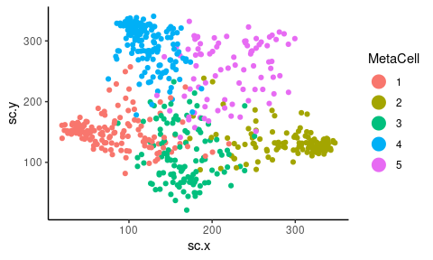
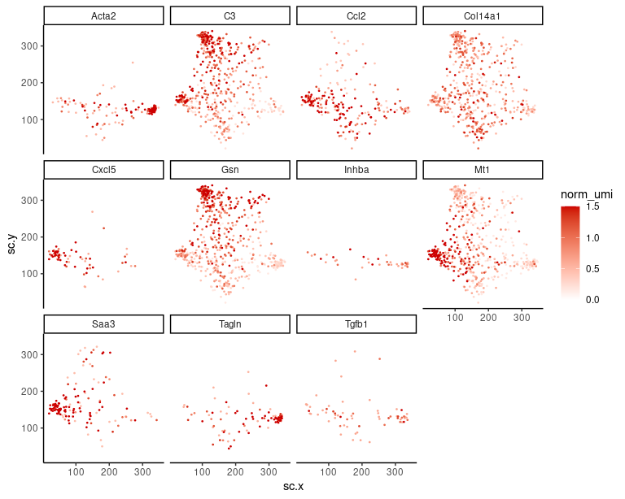
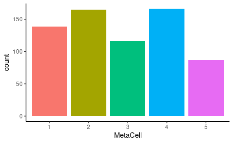
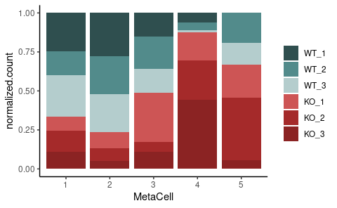

General analyses CAFs
================
Kaspar Bresser
20/10/2021

-   [MetaCell 2D projection](#metacell-2d-projection)
    -   [Plot MetaCells](#plot-metacells)
    -   [Plot gene-expression](#plot-gene-expression)
-   [Cell counts in experiment](#cell-counts-in-experiment)
-   [MetaCell composition](#metacell-composition)

Below some general visualizations of the tumor cell compartment of the
scRNAseq data.

## MetaCell 2D projection

Import the MetaCell object and the 2D coordinates.

``` r
scdb_init(here("Data", "Metacell_files_fibroblast"))
mc <- scdb_mc("QPCTL_fibro_MC")

str(mc)
```

    ## Formal class 'tgMCCov' [package "metacell"] with 10 slots
    ##   ..@ mc        : Named int [1:673] 1 2 1 2 1 2 1 1 3 4 ...
    ##   .. ..- attr(*, "names")= chr [1:673] "AAAGGGCGTACCAATC-1" "AAAGGGCGTATGTGTC-1" "AAAGTGAGTACGAGTG-1" "AACAACCTCTCCATAT-1" ...
    ##   ..@ outliers  : chr(0) 
    ##   ..@ cell_names: chr [1:673] "AAAGGGCGTACCAATC-1" "AAAGGGCGTATGTGTC-1" "AAAGTGAGTACGAGTG-1" "AACAACCTCTCCATAT-1" ...
    ##   ..@ mc_fp     : num [1:10555, 1:5] 1.102 0.951 0.93 1 0.998 ...
    ##   .. ..- attr(*, "dimnames")=List of 2
    ##   .. .. ..$ : chr [1:10555] "Mrpl15" "Lypla1" "Tcea1" "Atp6v1h" ...
    ##   .. .. ..$ : chr [1:5] "1" "2" "3" "4" ...
    ##   ..@ e_gc      : num [1:10555, 1:5] 5.70e-05 2.07e-05 5.74e-05 2.97e-05 7.21e-05 ...
    ##   .. ..- attr(*, "dimnames")=List of 2
    ##   .. .. ..$ : chr [1:10555] "Mrpl15" "Lypla1" "Tcea1" "Atp6v1h" ...
    ##   .. .. ..$ : chr [1:5] "1" "2" "3" "4" ...
    ##   ..@ cov_gc    : num [1:10555, 1:5] 0.331 0.144 0.338 0.201 0.381 ...
    ##   .. ..- attr(*, "dimnames")=List of 2
    ##   .. .. ..$ : chr [1:10555] "Mrpl15" "Lypla1" "Tcea1" "Atp6v1h" ...
    ##   .. .. ..$ : chr [1:5] "1" "2" "3" "4" ...
    ##   ..@ n_bc      : int [1, 1:5] 139 165 116 166 87
    ##   .. ..- attr(*, "dimnames")=List of 2
    ##   .. .. ..$ : chr "1"
    ##   .. .. ..$ : chr [1:5] "1" "2" "3" "4" ...
    ##   ..@ annots    : Named int [1:5] 3 4 2 1 5
    ##   .. ..- attr(*, "names")= chr [1:5] "1" "2" "3" "4" ...
    ##   ..@ colors    : chr [1:5] "#440154FF" "#3B528BFF" "#21908CFF" "#5DC863FF" ...
    ##   ..@ color_key :'data.frame':   0 obs. of  0 variables

``` r
MC.graph <- scdb_mc2d("QPCTL_fibro_MC")

coords <- tibble( cellcode = names(MC.graph@sc_y),
                  sc.x = MC.graph@sc_x,
                  sc.y = MC.graph@sc_y)
coords
```

    ## # A tibble: 673 × 3
    ##    cellcode            sc.x  sc.y
    ##    <chr>              <dbl> <dbl>
    ##  1 AAAGGGCGTACCAATC-1  39.5 163. 
    ##  2 AAAGGGCGTATGTGTC-1 328.  114. 
    ##  3 AAAGTGAGTACGAGTG-1  26.5 148. 
    ##  4 AACAACCTCTCCATAT-1 327.  121. 
    ##  5 AACAAGAGTAACGGTG-1  97.2 119. 
    ##  6 AACACACAGTGGGAAA-1 338.  139. 
    ##  7 AACAGGGAGGCCTAAG-1  98.8 143. 
    ##  8 AACCATGGTCGGAACA-1  50.0 152. 
    ##  9 AACCCAACAATAGTAG-1 169.   21.3
    ## 10 AACCTGACATACGCAT-1 102.  309. 
    ## # … with 663 more rows

### Plot MetaCells

Add the MetaCell identities to the coordinate data, and plot the 2D
projection.

``` r
str(mc@mc)
```

    ##  Named int [1:673] 1 2 1 2 1 2 1 1 3 4 ...
    ##  - attr(*, "names")= chr [1:673] "AAAGGGCGTACCAATC-1" "AAAGGGCGTATGTGTC-1" "AAAGTGAGTACGAGTG-1" "AACAACCTCTCCATAT-1" ...

``` r
mc@mc %>% 
  enframe(name = "cellcode", value = "MetaCell") %>% 
  inner_join(coords) %>% 
  mutate(MetaCell = as.factor(MetaCell)) %>% 
    ggplot( aes(x = sc.x, y = sc.y, color = MetaCell))+ 
      geom_point(size = 1.5)+
      theme_classic()+ 
      guides(color = guide_legend(override.aes = list(size = 5)))
```



``` r
ggsave(filename = here("Figs", "caf", "general_2d_proj_MCs.pdf"), device = "pdf", width = 4,height = 3.2)
```

### Plot gene-expression

get gene-expression of select genes

``` r
genes <- c('Acta2', 'Col14a1', 'Inhba', 'Tagln', 'C3', 'Gsn', 
           'Saa3', "Mt1", "Tgfb1", "Ccl2", "Cxcl5")


seurat.obj <- read_rds(here("Data", "seurat_Fibr.rds"))
seurat.obj <- NormalizeData(seurat.obj, assay = "RNA", normalization.method = "CLR")


seurat.obj %>% 
  GetAssayData( slot = "data", assay = "RNA")%>% 
#  as.matrix() %>%
  t() %>% 
  as.data.frame() %>% 
  as_tibble(rownames = "cellcode") %>% 
  select(one_of(c("cellcode", genes))) -> expression.data

expression.data
```

    ## # A tibble: 842 × 12
    ##    cellcode  Acta2 Col14a1 Inhba Tagln    C3   Gsn  Saa3   Mt1 Tgfb1  Ccl2 Cxcl5
    ##    <chr>     <dbl>   <dbl> <dbl> <dbl> <dbl> <dbl> <dbl> <dbl> <dbl> <dbl> <dbl>
    ##  1 AAAGGATG… 0       1.52   0    0     0.207 0.413 0     0      1.02 1.39  0    
    ##  2 AAAGGGCC… 0       0      2.00 0.556 0     0.617 0     2.96   0    1.95  0    
    ##  3 AAAGGGCG… 0       0.280  0    0     1.80  1.45  3.75  2.34   0    1.25  0    
    ##  4 AAAGGGCG… 3.25    0      0    2.98  0     0     0     0      0    0     0    
    ##  5 AAAGTGAC… 0       0.678  0    0     1.49  1.69  0     0      0    0.918 0    
    ##  6 AAAGTGAG… 0       0.280  0    0     1.87  0.861 3.60  2.03   0    0.695 0.597
    ##  7 AACAACCT… 3.58    0      0    1.17  0     0.413 0     0      0    0     0    
    ##  8 AACAAGAG… 0       0      0    0     0     0.413 0.472 1.40   0    0.918 1.78 
    ##  9 AACACACA… 0       0      0    0     0     0     0     0.157  0    0     0    
    ## 10 AACAGGGA… 0.511   0.830  0    0     0     0.413 0.792 1.05   0    0     0    
    ## # … with 832 more rows

Join with coordinates.

``` r
expression.data %>% 
  right_join(coords) %>% 
  pivot_longer(cols = -c("sc.y", "sc.x", "cellcode"), names_to = "gene", values_to = "norm_umi") -> for.plot
```

Cap the normalized UMI counts at `2` to make a nicer visualization, and
plot.

``` r
for.plot %>% 
  mutate(norm_umi = ifelse(norm_umi > 1.5, 1.5, norm_umi)) %>% 
  group_by(gene) %>% 
  arrange(norm_umi) %>% 
    ggplot( aes(x=sc.x, y=sc.y, color = norm_umi))+ 
      geom_point(size = 0.3)+
      scale_color_gradient2(low= "dodgerblue3", high= "red3", mid= "white", midpoint = 0)+
      theme_classic()+
      facet_wrap(~gene)
```



``` r
ggsave(filename = here("Figs", "caf", "general_2d_proj_genes.pdf"), width = 8, height = 7, useDingbats = F)
```

## Cell counts in experiment

Plot the number of cells in each MetaCell.

``` r
mc@mc %>% 
  enframe(name = "cellcode", value = "MetaCell") %>% 
  mutate(MetaCell = as.factor(MetaCell)) %>% 
    ggplot(aes(x = MetaCell, fill = MetaCell))+
      geom_bar(stat = "count")+
      theme_classic()+
      theme(legend.position = "none")
```



``` r
ggsave(filename = here("Figs", "caf", "general_cell_counts.pdf"), width = 4,height = 2, scale = 1.2)
```

## MetaCell composition

We profiled 3 QPCTL-KO TMEs and 3 QPCTL-WT TMEs. Plot the sample
composition of each MetaCell. The hashtag info is in the mat object.

``` r
mat.obj <- scdb_mat("QPCTL_exp_Fibr")

mat.obj@cell_metadata %>% 
  select(new_hash.ID) %>% 
  as_tibble(rownames = "cellcode") %>% 
  filter(str_detect(new_hash.ID, "HTO")) %>% 
  mutate(sample = fct_recode(new_hash.ID, WT_1 = "HTO1", WT_2 = "HTO2", WT_3 = "HTO3",
                                          KO_1 = "HTO4", KO_2 = "HTO5", KO_3 = "HTO6")) -> hashtags

hashtags
```

    ## # A tibble: 8,704 × 3
    ##    cellcode           new_hash.ID sample
    ##    <chr>              <chr>       <fct> 
    ##  1 AAACCCAAGTGATGGC-1 HTO4        KO_1  
    ##  2 AAACCCACAATCAAGA-1 HTO3        WT_3  
    ##  3 AAACCCAGTCCCTGAG-1 HTO4        KO_1  
    ##  4 AAACCCATCGTCGCTT-1 HTO1        WT_1  
    ##  5 AAACCCATCTTCGATT-1 HTO1        WT_1  
    ##  6 AAACGAAAGGACGCAT-1 HTO6        KO_3  
    ##  7 AAACGAACAATACAGA-1 HTO1        WT_1  
    ##  8 AAACGAACATATCTGG-1 HTO6        KO_3  
    ##  9 AAACGAAGTCACTACA-1 HTO2        WT_2  
    ## 10 AAACGAAGTGCAGATG-1 HTO4        KO_1  
    ## # … with 8,694 more rows

Combine with MetaCells and normalize within samples.

``` r
mc@mc %>% 
  enframe(name = "cellcode", value = "MetaCell") %>% 
  inner_join(hashtags) %>% 
  count(MetaCell, sample) %>%
  group_by(sample)%>%
  mutate(normalized.count = (n/sum(n))*1000 ) %>% 
  mutate(MetaCell = as.factor(MetaCell) ) -> sample.counts

sample.counts
```

    ## # A tibble: 29 × 4
    ## # Groups:   sample [6]
    ##    MetaCell sample     n normalized.count
    ##    <fct>    <fct>  <int>            <dbl>
    ##  1 1        WT_1      11             324.
    ##  2 1        WT_2      20             204.
    ##  3 1        WT_3      37             349.
    ##  4 1        KO_1      18             120 
    ##  5 1        KO_2      17             173.
    ##  6 1        KO_3      15             147.
    ##  7 2        WT_1      15             441.
    ##  8 2        WT_2      38             388.
    ##  9 2        WT_3      41             387.
    ## 10 2        KO_1      25             167.
    ## # … with 19 more rows

And plot

``` r
ggplot(sample.counts, aes(fill = sample, y=normalized.count, x=MetaCell)) + 
  geom_bar( stat="identity", position = "fill")+
  scale_fill_manual(values=c("#2F4F4F", "#528B8B", "#B4CDCD", "#CD5555","#A52A2A", "#8B2323"))+
  theme(legend.title = element_blank())
```



``` r
ggsave(filename = here("Figs", "caf", "general_sample_compostition.pdf"), width = 4, height = 3, useDingbats=FALSE)
```
