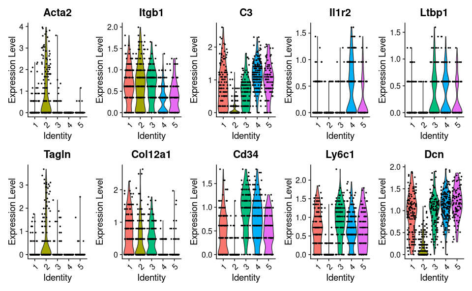
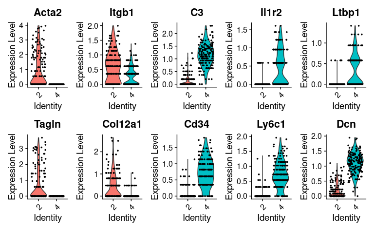
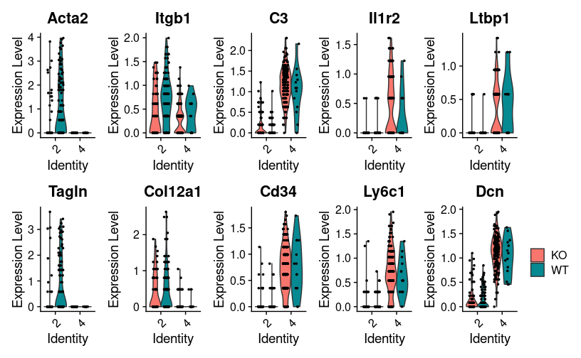

Marker genes CAFs
================
Kaspar Bresser
22/10/2021

-   [Import and normalize](#import-and-normalize)
-   [Plot CAF markers](#plot-caf-markers)

# Import and normalize

Import the Seurat object containing the CAFs.

``` r
scdb_init(here("Data", "Metacell_files_fibroblast"), force_reinit = T)
mc <- scdb_mc("QPCTL_fibro_MC")

(seurat.object <- read_rds(here("Data", "seurat_Fibr.rds")))
```

    ## An object of class Seurat 
    ## 31075 features across 842 samples within 3 assays 
    ## Active assay: RNA (31053 features, 0 variable features)
    ##  2 other assays present: HTO, ADT

Subset on only those cells that were assigned to a MetaCell, add
MetaCell identity as metadata.

``` r
seurat.object <- subset(seurat.object, cells = names(mc@mc))
seurat.object <- AddMetaData(seurat.object, mc@mc, "MetaCell")

seurat.object@meta.data %>% 
  mutate( genotype = case_when(hash.ID %in% c("HTO1", "HTO2", "HTO3") ~ "WT",
                              TRUE ~ "KO")) -> seurat.object@meta.data

seurat.object
```

    ## An object of class Seurat 
    ## 31075 features across 673 samples within 3 assays 
    ## Active assay: RNA (31053 features, 0 variable features)
    ##  2 other assays present: HTO, ADT

Normalize the RNA data.

``` r
seurat.object <- NormalizeData(seurat.object, normalization.method = "CLR", assay = "RNA")
```

Next, import the antibody capture data to investigate protein expression
levels. The seurat object contains all ADT data, so subset for the
fibroblast cells, add that to the `seurat.object`, and normalize.

``` r
seurat.ADT <- read_rds(here("Data", "seurat_adt.rds"))
seurat.ADT <- subset(seurat.ADT,  cells = names(mc@mc))

seurat.object[["antibody_capture"]] <- seurat.ADT[["antibody_capture"]]

seurat.object <- NormalizeData(seurat.object, normalization.method = "CLR", assay = "antibody_capture")
```

# Plot CAF markers

Will look at a number of genes that are of interest to CAF biology. Used
the [Nature Communations paper from Grauel and
collegues](https://www.nature.com/articles/s41467-020-19920-5) as a
reference.

C3 and Cd34 are described as iCAF markers. iCAFs are known to be Il1b
driven, so I’ll look at expression of Il1r2. Furthermore,
[Dcn](https://www.oncotarget.com/article/23869/text/) and
[Ltbp1](https://www.uniprot.org/uniprot/Q14766) are known to bind and
inhibit function of TGFb.

Plot expression in all MetaCells

``` r
Idents(seurat.object) <- "MetaCell"

VlnPlot(seurat.object, 
        features = c("Acta2", "Itgb1", "C3", "Il1r2", "Ltbp1", 
                     "Tagln", "Col12a1", "Cd34", "Ly6c1", "Dcn"), pt.size = 0.5 , ncol = 5)
```



``` r
ggsave(here("Figs", "caf", "markers_violin.pdf"), width = 3.5, height = 1.5, scale = 3)
```

Or zoom in on the iCAF (MC4) and myCAF (MC2) MetaCells

``` r
VlnPlot(seurat.object, 
        features = c("Acta2", "Itgb1", "C3", "Il1r2", "Ltbp1", 
                     "Tagln", "Col12a1", "Cd34", "Ly6c1", "Dcn"), pt.size = 0.6 , idents = c("2", "4"), ncol = 5)
```



``` r
ggsave(here("Figs", "caf", "markers_violin_2and4_only.pdf"), width = 2.5, height = 1.5, scale = 3)
```

As an extra layer of information, we can split by the origin of the
cells (KO or WT TME).

``` r
VlnPlot(seurat.object, 
        features = c("Acta2", "Itgb1", "C3", "Il1r2", "Ltbp1", 
                     "Tagln", "Col12a1", "Cd34", "Ly6c1", "Dcn"), 
        idents = c("2", "4"), split.by = "genotype", 
        pt.size = 0.6, ncol = 5 ) + theme(legend.position = "right")
```



``` r
ggsave(here("Figs", "caf", "markers_violin_2and4_only_split.pdf"), width = 2.5, height = 1.5, scale = 3)

seurat.object@meta.data %>% 
  count(genotype, MetaCell)
```

    ##    genotype MetaCell   n
    ## 1        KO        1  68
    ## 2        KO        2  60
    ## 3        KO        3  74
    ## 4        KO        4 152
    ## 5        KO        5  64
    ## 6        WT        1  71
    ## 7        WT        2 105
    ## 8        WT        3  42
    ## 9        WT        4  14
    ## 10       WT        5  23

There seems to be some level of within MetaCell heterogeneity here.
Specifically the myofibroblastic markers of MC2 appear to be mainly
expressed by cells from the WT setting.

We also used CITEseq antibodies, lets zoom in on iCAF and myCAF markers
Ly6C and ITGB1.

``` r
VlnPlot(object = seurat.object, features =c("Ly6C", "ITGB1"), idents = c("2", "4"), assay = "antibody_capture", pt.size = 0.2, y.max = 3)
```

    ## Warning: Removed 1 rows containing non-finite values (stat_ydensity).

    ## Warning: Removed 1 rows containing missing values (geom_point).


``` r
ggsave(here("Figs", "caf", "markers_violin_CITE.pdf"), width = 2, height = 2, scale = 1.5)
```

    ## Warning: Removed 1 rows containing non-finite values (stat_ydensity).

    ## Warning: Removed 1 rows containing missing values (geom_point).

There’s not a whole lot of cells, but we can additionally split these
cells based on their origin from KO or WT TME’s.

``` r
VlnPlot(object = seurat.object, features =c("Ly6C", "ITGB1"), idents = c("2", "4"), 
        assay = "antibody_capture", split.by = "genotype", pt.size = 0.2, y.max = 3) + theme(legend.position = "right")
```

    ## Warning: Removed 1 rows containing non-finite values (stat_ydensity).

    ## Warning: Removed 1 rows containing missing values (geom_point).


``` r
ggsave(here("Figs", "caf", "markers_violin_CITE_split.pdf"), width = 3, height = 2, scale = 1.5)
```

    ## Warning: Removed 1 rows containing non-finite values (stat_ydensity).

    ## Warning: Removed 1 rows containing missing values (geom_point).

Interestingly it seems that KO cells that reside in MetaCell 2 express
higher levels of Ly6C, and lower levels of ITGB1.

Quick check to see if RNA follows the same pattern.

``` r
VlnPlot(object = seurat.object, features =c("Ly6c1", "Itgb1"), idents = c("2", "4"), 
        assay = "RNA", split.by = "genotype", pt.size = 0.3) + theme(legend.position = "right")
```


