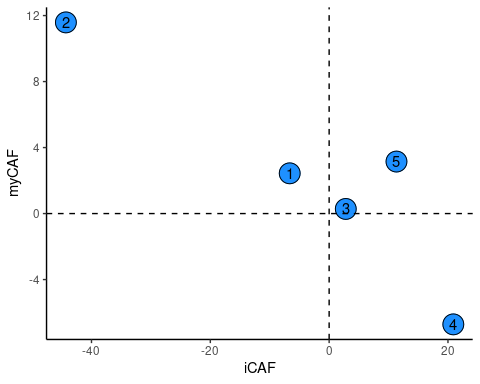
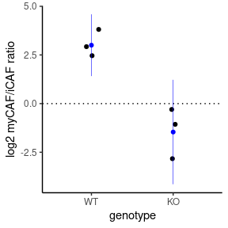

iCAF/myCAF analyses
================
Kaspar Bresser
22/10/2021

-   [Plot CAF signatures](#plot-caf-signatures)
-   [Plot CAF ratio’s](#plot-caf-ratios)

In the analyses below I compare the cancer associated fibroblasts from
our scRNAseq dataset to iCAF and myCAF signatures identified by others
and quantify their presence in the TME.

Load packages needed for the analysis.

And import data

``` r
scdb_init(here("Data", "Metacell_files_fibroblast"), force_reinit = T)
mc <- scdb_mc("QPCTL_fibro_MC")

seurat.object <- read_rds(here("Data", "seurat_Fibr.rds"))
```

## Plot CAF signatures

Import iCAF and myCAF signatures

``` r
(iCAF <- read_lines(here("Data", "iCAF.txt")))
```

    ##  [1] "Clec3b"   "Gsn"      "Ptx3"     "Ly6c1"    "Efemp1"   "Ly6a"    
    ##  [7] "Figf"     "Tnfaip6"  "Ifi27l2a" "Dpt"      "Adm"      "Plpp3"   
    ## [13] "Tnxb"     "Cxcl12"   "Gstm1"    "C4b"      "Ogn"      "C3"      
    ## [19] "Pcolce2"  "Cxcl1"    "Col14a1"  "Svep1"    "Adamts5"  "Hp"      
    ## [25] "Has1"     "Scara3"   "Ifi205"   "Dpep1"    "Sfrp4"    "Prss23"  
    ## [31] "Ackr3"    "Htra3"    "Apoe"     "Ccl7"     "Il6"      "Sfrp2"   
    ## [37] "Pla1a"    "Scara5"   "Sned1"

``` r
(myCAF <- read_lines(here("Data", "myCAF.txt")))
```

    ##  [1] "Spp1"     "Serpine2" "Cxcl14"   "Crlf1"    "Igfbp3"   "Acta2"   
    ##  [7] "Tagln"    "Thy1"     "Col8a1"   "Cthrc1"   "Sfrp1"    "Tnc"     
    ## [13] "Sparcl1"  "Col15a1"  "Col12a1"  "Tgfb1"    "Col1a1"   "Sdc1"    
    ## [19] "Cilp"     "H19"      "Thbs2"

Get log2 gene-enrichment values. And add iCAF/myCAF annotation

``` r
mc@mc_fp %>% 
  log2() %>% 
  as_tibble(rownames = "gene") %>% 
  mutate(signature = case_when(gene %in% iCAF ~ "iCAF",
                               gene %in% myCAF ~ "myCAF",
                               TRUE ~ "none")) %>% 
  pivot_longer(cols = -c(gene, signature), names_to = "MC",values_to = "lfp" ) -> lfp

lfp  
```

    ## # A tibble: 52,775 × 4
    ##    gene   signature MC        lfp
    ##    <chr>  <chr>     <chr>   <dbl>
    ##  1 Mrpl15 none      1      0.140 
    ##  2 Mrpl15 none      2      0.161 
    ##  3 Mrpl15 none      3     -0.0422
    ##  4 Mrpl15 none      4      0     
    ##  5 Mrpl15 none      5     -0.194 
    ##  6 Lypla1 none      1     -0.0727
    ##  7 Lypla1 none      2      0.0450
    ##  8 Lypla1 none      3      0     
    ##  9 Lypla1 none      4      0.0552
    ## 10 Lypla1 none      5     -0.131 
    ## # … with 52,765 more rows

Summarise by signature.

``` r
lfp %>% 
  group_by(signature, MC) %>% 
  summarise(sig_score = sum(lfp)) %>% 
  ungroup %>% 
  # switch to long for dotplot
  pivot_wider( names_from = signature, values_from = sig_score) -> CAFsigs

CAFsigs
```

    ## # A tibble: 5 × 4
    ##   MC      iCAF  myCAF   none
    ##   <chr>  <dbl>  <dbl>  <dbl>
    ## 1 1      -6.64  2.44    5.36
    ## 2 2     -44.3  11.6    62.8 
    ## 3 3       2.80  0.279 221.  
    ## 4 4      20.9  -6.72   25.2 
    ## 5 5      11.3   3.15  -23.4

Plot signature scores

``` r
ggplot(CAFsigs, aes(x = iCAF, y = myCAF, label = MC))+
  geom_point(size = 7,color = "dodgerblue")+
  geom_point(size = 7, pch=21,color = "black")+
  geom_text()+
  geom_hline(yintercept = 0, linetype = "dashed")+
  geom_vline(xintercept = 0, linetype = "dashed")
```



``` r
ggsave(here("Figs", "caf", "sig_exprCAFs.pdf"), width = 4, height = 4, scale = .75, useDingbats = F)
```

## Plot CAF ratio’s

Import Seurat object and count cells

``` r
full.seurat <- read_rds(here("Data", "seurat_Fibr.rds"))

enframe(full.seurat$hash.ID, "cellcode", "Hashtag") %>% 
  right_join(enframe(as.factor(mc@mc), "cellcode", "MC")) %>% 
  count(Hashtag, MC) -> cell.counts

cell.counts
```

    ## # A tibble: 29 × 3
    ##    Hashtag MC        n
    ##    <chr>   <fct> <int>
    ##  1 HTO1    1        13
    ##  2 HTO1    2        21
    ##  3 HTO1    3         6
    ##  4 HTO1    4         3
    ##  5 HTO2    1        21
    ##  6 HTO2    2        40
    ##  7 HTO2    3        20
    ##  8 HTO2    4         8
    ##  9 HTO2    5        13
    ## 10 HTO3    1        37
    ## # … with 19 more rows

Normalize within hashtags, select MetaCell 2 and 4, calculate ratio’s
and add samples identities.

``` r
cell.counts %>% 
  # Normalize per hashtag
  group_by(Hashtag)%>%
  mutate(normalized.count = (n/sum(n))*1000 ) %>% 
  ungroup() %>% 
  # filter to the iCAF and myCAF MCs
  filter(MC %in% c("2","4")) %>% 
  # put counts in separate columns and calculate ratio
  pivot_wider(id_cols = -n, names_from = MC, values_from = normalized.count) %>% 
  mutate(ratio = `2`/`4`) %>% 
  # Add genotype identity
  mutate(genotype = fct_collapse(Hashtag,WT = c("HTO1","HTO2","HTO3"), 
                                 KO = c("HTO4", "HTO5", "HTO6")  )) -> for.plot

for.plot
```

    ## # A tibble: 6 × 5
    ##   Hashtag   `2`   `4`  ratio genotype
    ##   <chr>   <dbl> <dbl>  <dbl> <fct>   
    ## 1 HTO1     488.  69.8  7     WT      
    ## 2 HTO2     392.  78.4  5     WT      
    ## 3 HTO3     400   27.3 14.7   WT      
    ## 4 HTO4     179. 243.   0.738 KO      
    ## 5 HTO5     160  312    0.513 KO      
    ## 6 HTO6      75  592.   0.127 KO

And make the plot.

``` r
ggplot(for.plot, aes(x = genotype, y = log2(ratio))) +
  geom_jitter(position=position_jitter(0.1))+
  geom_hline( yintercept = 0,  linetype="dotted")+ 
  stat_summary(fun.data=mean_sdl,  geom="pointrange", color="blue", cex = 0.2)+
  labs(y = "log2 myCAF/iCAF ratio")
```



``` r
ggsave( here("Figs", "caf", "sig_exprCAFsRatio.pdf"), width = 3, height = 4, scale = .75, useDingbats = F)
```
