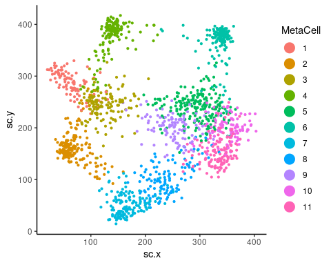
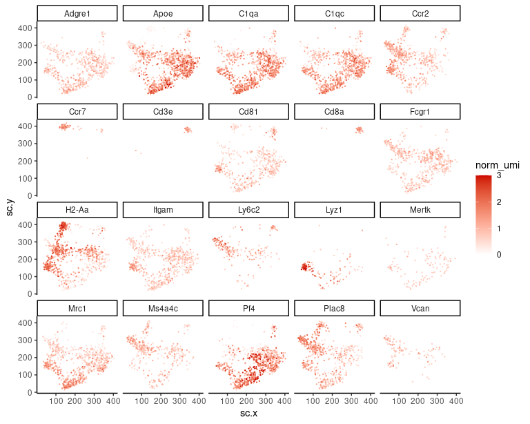
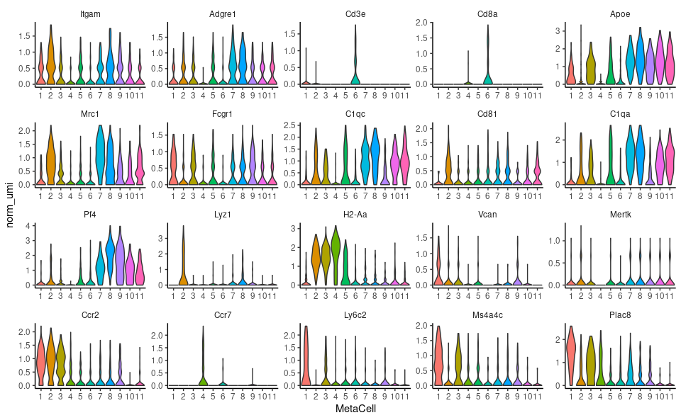
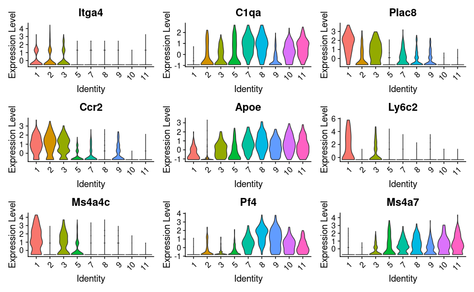
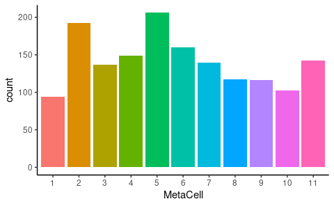
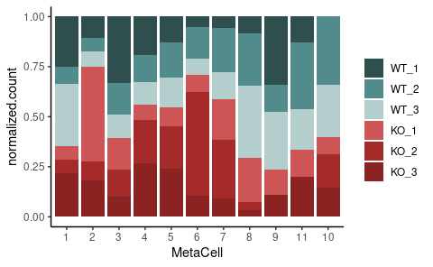

General analyses Immune cells
================
Kaspar Bresser
20/10/2021

-   [MetaCell 2D projection](#metacell-2d-projection)
    -   [plot MetaCells](#plot-metacells)
    -   [Plot gene-expression](#plot-gene-expression)
    -   [As Violin](#as-violin)
-   [Cell counts in experiment](#cell-counts-in-experiment)
-   [MetaCell composition](#metacell-composition)

Below some general visualizations of the immune cell compartment of the
scRNAseq data.

## MetaCell 2D projection

Import the MetaCell object and the 2D coordinates.

``` r
scdb_init(here("Data", "Metacell_files_imm"))
mc <- scdb_mc("QPCTL_Imm_MC")

str(mc)
```

    ## Formal class 'tgMCCov' [package "metacell"] with 10 slots
    ##   ..@ mc        : Named int [1:1555] 4 10 3 9 11 8 6 3 11 9 ...
    ##   .. ..- attr(*, "names")= chr [1:1555] "AAACGCTCACGCTTAA-1" "AAAGAACGTTGCTCGG-1" "AAAGAACTCTCGCGTT-1" "AAAGGATAGTTCGCAT-1" ...
    ##   ..@ outliers  : chr(0) 
    ##   ..@ cell_names: chr [1:1555] "AAACGCTCACGCTTAA-1" "AAAGAACGTTGCTCGG-1" "AAAGAACTCTCGCGTT-1" "AAAGGATAGTTCGCAT-1" ...
    ##   ..@ mc_fp     : num [1:10715, 1:11] 1.014 0.945 1.112 0.984 1.062 ...
    ##   .. ..- attr(*, "dimnames")=List of 2
    ##   .. .. ..$ : chr [1:10715] "Mrpl15" "Lypla1" "Tcea1" "Atp6v1h" ...
    ##   .. .. ..$ : chr [1:11] "1" "2" "3" "4" ...
    ##   ..@ e_gc      : num [1:10715, 1:11] 6.02e-05 1.66e-05 9.48e-05 5.23e-05 5.23e-05 ...
    ##   .. ..- attr(*, "dimnames")=List of 2
    ##   .. .. ..$ : chr [1:10715] "Mrpl15" "Lypla1" "Tcea1" "Atp6v1h" ...
    ##   .. .. ..$ : chr [1:11] "1" "2" "3" "4" ...
    ##   ..@ cov_gc    : num [1:10715, 1:11] 0.1277 0.0319 0.1809 0.117 0.117 ...
    ##   .. ..- attr(*, "dimnames")=List of 2
    ##   .. .. ..$ : chr [1:10715] "Mrpl15" "Lypla1" "Tcea1" "Atp6v1h" ...
    ##   .. .. ..$ : chr [1:11] "1" "2" "3" "4" ...
    ##   ..@ n_bc      : int [1, 1:11] 94 192 137 149 206 160 140 117 116 102 ...
    ##   .. ..- attr(*, "dimnames")=List of 2
    ##   .. .. ..$ : chr "1"
    ##   .. .. ..$ : chr [1:11] "1" "2" "3" "4" ...
    ##   ..@ annots    : Named int [1:11] 4 1 7 10 3 5 6 9 8 2 ...
    ##   .. ..- attr(*, "names")= chr [1:11] "1" "2" "3" "4" ...
    ##   ..@ colors    : chr [1:11] "#440154FF" "#482576FF" "#414487FF" "#35608DFF" ...
    ##   ..@ color_key :'data.frame':   0 obs. of  0 variables

``` r
MC.graph <- scdb_mc2d("QPCTL_Imm_MC")

coords <- tibble( cellcode = names(MC.graph@sc_y),
                  sc.x = MC.graph@sc_x,
                  sc.y = MC.graph@sc_y)
coords
```

    ## # A tibble: 1,555 × 3
    ##    cellcode            sc.x  sc.y
    ##    <chr>              <dbl> <dbl>
    ##  1 AAACGCTCACGCTTAA-1  144. 400. 
    ##  2 AAAGAACGTTGCTCGG-1  327. 204. 
    ##  3 AAAGAACTCTCGCGTT-1  159. 284. 
    ##  4 AAAGGATAGTTCGCAT-1  312. 190. 
    ##  5 AAAGGATGTCAATCTG-1  333. 135. 
    ##  6 AAAGGATTCGTTAGAC-1  179.  57.9
    ##  7 AAAGGTATCAAACCCA-1  346. 378. 
    ##  8 AAAGTCCGTTAGGCCC-1  206. 295. 
    ##  9 AAAGTGACATAGACTC-1  327. 193. 
    ## 10 AAAGTGATCATCGCCT-1  232. 221. 
    ## # … with 1,545 more rows

### plot MetaCells

Add the MetaCell identities to the coordinate data, and plot the 2D
projection.

``` r
str(mc@mc)
```

    ##  Named int [1:1555] 4 10 3 9 11 8 6 3 11 9 ...
    ##  - attr(*, "names")= chr [1:1555] "AAACGCTCACGCTTAA-1" "AAAGAACGTTGCTCGG-1" "AAAGAACTCTCGCGTT-1" "AAAGGATAGTTCGCAT-1" ...

``` r
mc@mc %>% 
  enframe(name = "cellcode", value = "MetaCell") %>% 
  inner_join(coords) %>% 
  mutate(MetaCell = as.factor(MetaCell)) %>% 
    ggplot( aes(x = sc.x, y = sc.y, color = MetaCell))+ 
      geom_point(size = .8)+
      theme_classic()+ 
      guides(color = guide_legend(override.aes = list(size = 5)))
```



``` r
ggsave(filename = here("Figs", "immune", "general_2d_proj_MCs.pdf"), device = "pdf", width = 4,height = 3.2)
```

### Plot gene-expression

get gene-expression of select genes

``` r
genes <- c("Itgam", "Adgre1", "Cd3e", "Cd8a", "Apoe", "Mrc1", 
           "Fcgr1","C1qc", "Cd81", "C1qa", "Pf4", "Lyz1", "H2-Aa", 
           "Vcan", "Mertk", "Ccr2", "Ccr7", "Ly6c2", "Ms4a4c", "Plac8" )


seurat.obj <- read_rds(here("Data", "seurat_immune.rds"))
seurat.obj <- NormalizeData(seurat.obj, assay = "RNA", normalization.method = "CLR")


seurat.obj %>% 
  GetAssayData( slot = "data", assay = "RNA")%>% 
#  as.matrix() %>%
  t() %>% 
  as.data.frame() %>% 
  as_tibble(rownames = "cellcode") %>% 
  select(one_of(c("cellcode", genes))) -> expression.data

expression.data
```

    ## # A tibble: 1,956 × 21
    ##    cellcode   Itgam Adgre1  Cd3e  Cd8a  Apoe  Mrc1 Fcgr1  C1qc  Cd81  C1qa   Pf4
    ##    <chr>      <dbl>  <dbl> <dbl> <dbl> <dbl> <dbl> <dbl> <dbl> <dbl> <dbl> <dbl>
    ##  1 AAACGAAAG…  0     0     0     0     1.79   1.10 0.541 1.13  1.54  1.58  2.08 
    ##  2 AAACGCTCA…  0     0     0     0     0      0    0     0     0     0     0    
    ##  3 AAAGAACGT…  0     0     0     0     1.34   0    0     0     0     0.258 1.82 
    ##  4 AAAGAACTC…  0     0     0     0     1.16   0    0.541 0     0     0     0    
    ##  5 AAAGGATAG…  0     0.534 0     0     1.21   1.10 0.890 0     0     0     2.97 
    ##  6 AAAGGATGT…  0     0     0     0     1.21   1.10 0     1.83  0.477 1.84  2.00 
    ##  7 AAAGGATTC…  0     0.880 0     0     0.579  1.10 1.15  0.300 0.477 0.464 0.647
    ##  8 AAAGGTATC…  0     0     0.679 0.679 0.146  0    0     0     0     0     0.265
    ##  9 AAAGGTATC…  0     0     0     0     0.880  1.10 0     1.50  0     0.779 2.89 
    ## 10 AAAGTCCAG…  1.47  0.534 0     0     1.06   2.09 0.541 1.42  1.66  1.97  3.02 
    ## # … with 1,946 more rows, and 9 more variables: Lyz1 <dbl>, H2-Aa <dbl>,
    ## #   Vcan <dbl>, Mertk <dbl>, Ccr2 <dbl>, Ccr7 <dbl>, Ly6c2 <dbl>, Ms4a4c <dbl>,
    ## #   Plac8 <dbl>

Join with coordinates.

``` r
expression.data %>% 
  right_join(coords) %>% 
  pivot_longer(cols = -c("sc.y", "sc.x", "cellcode"), names_to = "gene", values_to = "norm_umi") -> for.plot
```

Cap the normalized UMI counts at `3` to make a nicer visualization, and
plot.

``` r
for.plot %>% 
  mutate(norm_umi = ifelse(norm_umi > 3, 3, norm_umi)) %>% 
  group_by(gene) %>% 
  arrange(norm_umi) %>% 
    ggplot( aes(x=sc.x, y=sc.y, color = norm_umi))+ 
      geom_point(size = 0.15)+
      scale_color_gradient2(low= "dodgerblue3", high= "red3", mid= "white", midpoint = 0)+
      theme_classic()+
      facet_wrap(~gene)
```



``` r
ggsave(filename = here("Figs", "immune", "general_2d_proj_genes.pdf"), width = 8, height = 6, useDingbats = F)
```

### As Violin

``` r
mc@mc %>% 
  enframe(name = "cellcode", value = "MetaCell") %>% 
  inner_join(for.plot) %>% 
  mutate(MetaCell = as.factor(MetaCell),
         gene = factor(gene, levels = genes)) %>%
    ggplot(aes(x = MetaCell, y = norm_umi, fill = MetaCell))+
      geom_violin(scale = "width")+
      facet_wrap(~gene, scales = "free")+
      theme( strip.background = element_blank(), legend.position = "none")
```



Resident vs Blood-derived marks violins

``` r
seurat.obj <- ScaleData(seurat.obj, assay = "RNA")
seurat.obj <- AddMetaData(seurat.obj, metadata = mc@mc, col.name = "MC")

Idents(seurat.obj) <- "MC"
seurat.obj@active.ident <- factor(x = seurat.obj@active.ident, levels = 1:11)

to.plot <- c("Itga4", "C1qa", "Plac8", "Ccr2", "Apoe", "Ly6c2", "Ms4a4c",'Pf4','Ms4a7' )

VlnPlot(seurat.obj, features = to.plot, pt.size = 0, idents = c('1','2','3','5','7','8','9','10','11'), slot = "scale.data")
```



``` r
ggsave(filename = here("Figs", "immune", "general_violins_infVSres.pdf"), width = 8, height = 6)
```

## Cell counts in experiment

Plot the number of cells in each MetaCell.

``` r
mc@mc %>% 
  enframe(name = "cellcode", value = "MetaCell") %>% 
  mutate(MetaCell = as.factor(MetaCell)) %>% 
    ggplot(aes(x = MetaCell, fill = MetaCell))+
      geom_bar(stat = "count")+
      theme_classic()+
      theme(legend.position = "none")
```



``` r
ggsave(filename = here("Figs", "immune", "general_cell_counts.pdf"), width = 4,height = 2, scale = 1.2)
```

## MetaCell composition

We profiled 3 QPCTL-KO TMEs and 3 QPCTL-WT TMEs. Plot the sample
composition of each MetaCell. The hashtag info is in the mat object.

``` r
mat.obj <- scdb_mat("QPCTL_exp_Imm")

mat.obj@cell_metadata %>% 
  select(new_hash.ID) %>% 
  as_tibble(rownames = "cellcode") %>% 
  filter(str_detect(new_hash.ID, "HTO")) %>% 
  mutate(sample = fct_recode(new_hash.ID, WT_1 = "HTO1", WT_2 = "HTO2", WT_3 = "HTO3",
                                          KO_1 = "HTO4", KO_2 = "HTO5", KO_3 = "HTO6")) -> hashtags

hashtags
```

    ## # A tibble: 8,704 × 3
    ##    cellcode           new_hash.ID sample
    ##    <chr>              <chr>       <fct> 
    ##  1 AAACCCAAGTGATGGC-1 HTO4        KO_1  
    ##  2 AAACCCACAATCAAGA-1 HTO3        WT_3  
    ##  3 AAACCCAGTCCCTGAG-1 HTO4        KO_1  
    ##  4 AAACCCATCGTCGCTT-1 HTO1        WT_1  
    ##  5 AAACCCATCTTCGATT-1 HTO1        WT_1  
    ##  6 AAACGAAAGGACGCAT-1 HTO6        KO_3  
    ##  7 AAACGAACAATACAGA-1 HTO1        WT_1  
    ##  8 AAACGAACATATCTGG-1 HTO6        KO_3  
    ##  9 AAACGAAGTCACTACA-1 HTO2        WT_2  
    ## 10 AAACGAAGTGCAGATG-1 HTO4        KO_1  
    ## # … with 8,694 more rows

Combine with MetaCells and normalize within samples.

``` r
mc@mc %>% 
  enframe(name = "cellcode", value = "MetaCell") %>% 
  inner_join(hashtags) %>% 
  count(MetaCell, sample) %>%
  group_by(sample)%>%
  mutate(normalized.count = (n/sum(n))*1000 ) %>% 
  mutate(MetaCell = as.factor(MetaCell) ) -> sample.counts

sample.counts
```

    ## # A tibble: 63 × 4
    ## # Groups:   sample [6]
    ##    MetaCell sample     n normalized.count
    ##    <fct>    <fct>  <int>            <dbl>
    ##  1 1        WT_1       5            139. 
    ##  2 1        WT_2       7             48.6
    ##  3 1        WT_3      35            171. 
    ##  4 1        KO_1       6             39.0
    ##  5 1        KO_2       3             37.5
    ##  6 1        KO_3      11            121. 
    ##  7 2        WT_1       3             83.3
    ##  8 2        WT_2       8             55.6
    ##  9 2        WT_3      12             58.5
    ## 10 2        KO_1      58            377. 
    ## # … with 53 more rows

And plot

``` r
ggplot(sample.counts, aes(fill = sample, y=normalized.count, x=MetaCell)) + 
  geom_bar( stat="identity", position = "fill")+
  scale_fill_manual(values=c("#2F4F4F", "#528B8B", "#B4CDCD", "#CD5555","#A52A2A", "#8B2323"))+
  theme(legend.title = element_blank())
```



``` r
ggsave(filename = here("Figs", "immune", "general_sample_compostition.pdf"), width = 4, height = 3, useDingbats=FALSE)
```
