Pseudotime analysis on Macro/Mono subset 1
================
Kaspar Bresser
20/10/2021

-   [Prepare dataset](#prepare-dataset)
-   [Pseudotime analysis](#pseudotime-analysis)
    -   [Perform slingshot](#perform-slingshot)
    -   [Test for genes associated with
        pseudotime](#test-for-genes-associated-with-pseudotime)
    -   [Cluster and plot associations](#cluster-and-plot-associations)
-   [Enrichment of QPCTL-prof or
    -def](#enrichment-of-qpctl-prof-or--def)
-   [Analysis of pseudotime
    terminals](#analysis-of-pseudotime-terminals)

In the immune compartment of the scRNAseq dataset, we identified 2
Macro/Mono subsets. In subset 1 we could see an enrichment and depletion
of certain MetaCells. To dive into this further, we made use of an
pseudotime analysis to assess if expression of certain genes was
associated with a QPCTL-proficient or deficient state.

Import packages and data needed for the analysis.

## Prepare dataset

Add MetaCells of interest (1-3) as metadata.

``` r
MCs <- mc@mc[mc@mc %in% c(1,2,3)]

seurat.obj <- AddMetaData(object = seurat.obj, metadata = MCs, col.name = "MCs")
```

Add MetaCell coordinates to seurat object as a custom dimensionality
reduction. First merge metacell coords with some metadata columns, to
make sure the length of the matrix matches that of the seurat object.

``` r
coords <- data.frame( row.names =  names(MC.graph@sc_y),
                  MC_1 = MC.graph@sc_x,
                  MC_2 = MC.graph@sc_y)
head(coords)
```

    ##                        MC_1      MC_2
    ## AAACGCTCACGCTTAA-1 143.6306 399.88850
    ## AAAGAACGTTGCTCGG-1 327.3614 203.64415
    ## AAAGAACTCTCGCGTT-1 158.9340 283.89437
    ## AAAGGATAGTTCGCAT-1 312.1463 190.38354
    ## AAAGGATGTCAATCTG-1 332.6083 135.13819
    ## AAAGGATTCGTTAGAC-1 179.2316  57.92536

``` r
coords <- merge(coords, seurat.obj@meta.data[,c(13,14)], by = 0, all = T)

coords %>% 
  select(Row.names, MC_1, MC_2) %>% 
  column_to_rownames("Row.names") %>% 
  as.matrix() -> coords

seurat.obj[["mcs"]] <- CreateDimReducObject(embeddings = coords, key = "MC_", assay = DefaultAssay(seurat.obj))
```

We can now use the MetaCell 2d coordinates as you would any other
dimensional reduction in downstream functions.

Lets subset on the MetaCells of interest.

``` r
Idents(seurat.obj) <- "MCs"

DimPlot(seurat.obj, reduction = "mcs", pt.size = 0.5)
```

    ## Warning: Removed 401 rows containing missing values (geom_point).

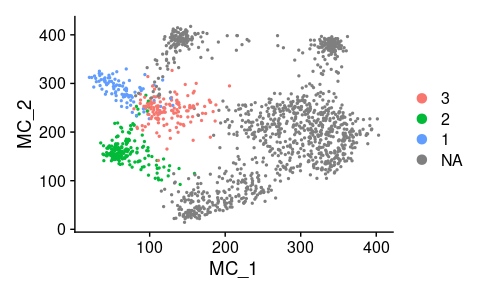

``` r
seurat.obj <- subset(seurat.obj, cells = row.names(subset(seurat.obj@meta.data, !is.na(MCs) ) ))


DimPlot(seurat.obj, reduction = "mcs", pt.size = 1.5)
```

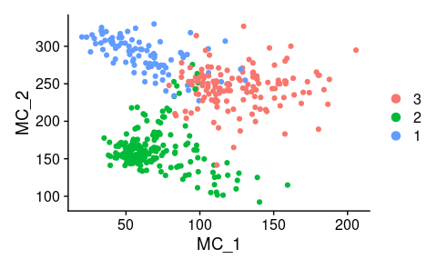

## Pseudotime analysis

### Perform slingshot

Normalize data, and perform
[slingshot](https://bioconductor.org/packages/release/bioc/html/slingshot.html)
analysis to get pseudotime values.

``` r
# add normalized counts
seurat.obj <- NormalizeData(object = seurat.obj, normalization.method = "LogNormalize", scale.factor = 10000)

# create sce and perform slingshot
immune.sce <- as.SingleCellExperiment(seurat.obj)
immune.sce <- immune.sce[,names(MCs)]
immune.sce <- slingshot(data = immune.sce, clusterLabels = "MCs", reducedDim = "MCS")
```

Pseudotime values are now saved in the `SingleCellExperiment` object.

### Test for genes associated with pseudotime

Next we’ll get both the log-transformed and untransformed expression
values. Focus on the genes that were used for the MetaCell generation.

``` r
# get vargenes used for MC generation
vargenes <- scdb_gset("QPCTL_Imm_feats_filt")
vargenes <- names(vargenes@gene_set)

# get the log transformed counts from the sce object, subset for vargenes and cellcodes
logexpr <- as.matrix(seurat.obj@assays$RNA@data)[vargenes, names(MCs)]
# same, but to get non-transformed data
expr <- as.matrix(seurat.obj@assays$RNA@counts)[vargenes, names(MCs)]
```

Extract the pseudotime values and cell-weights that were generated by
slingshot.

``` r
lineages <- slingPseudotime(immune.sce)
cellWeights <- slingCurveWeights(immune.sce)
```

We’ll be testing for genes associated to pseudotime using General
Additive Models, we can use `evaluateK` to assess the number of knots
that would be optimal for GAM fitting. Note that we use untransformed
expression data here. See
[here](http://bioconductor.org/packages/release/bioc/vignettes/tradeSeq/inst/doc/fitGAM.html)
for more info on evaluateK.

``` r
# Evaluate the number of knots needed for GAM fitting
icMat2 <- evaluateK(counts = expr, pseudotime = lineages, cellWeights = cellWeights,
                    k=3:7, nGenes = 100, verbose = FALSE, plot = TRUE)
```

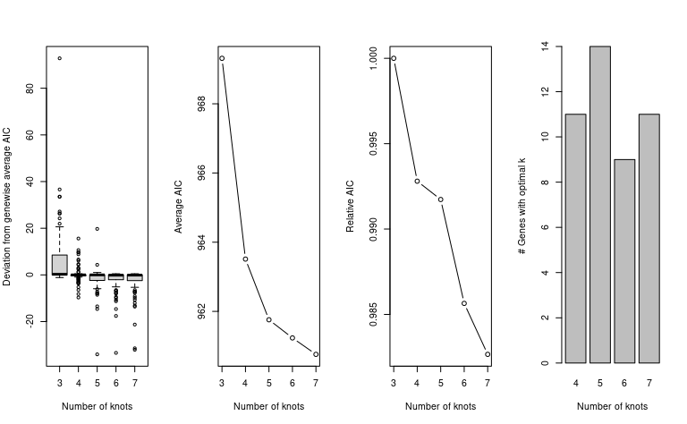

We’ll fit the GAMs with using `nknots = 5`

``` r
immune.sce <- fitGAM(counts = expr, sds = SlingshotDataSet(immune.sce), nknots = 5)
```

Next, test for dynamic expression, output will have genes associated
with pseudotime

``` r
assoRes <- associationTest(immune.sce)

(assoRes <- as_tibble(assoRes, rownames = "gene"))
```

    ## # A tibble: 443 × 5
    ##    gene    waldStat    df   pvalue meanLogFC
    ##    <chr>      <dbl> <dbl>    <dbl>     <dbl>
    ##  1 Ptpn18   14.6        3 0.00219     0.259 
    ##  2 Map4k4    0.0468     3 0.997       0.0180
    ##  3 Slc40a1   1.70       3 0.636       2.54  
    ##  4 Stat1     0.462      3 0.927       0.0547
    ##  5 Hspe1    13.0        3 0.00466     0.124 
    ##  6 Fn1     136.         3 0           0.866 
    ##  7 Pid1      5.93       3 0.115       0.101 
    ##  8 Ncl       3.57       3 0.311       0.255 
    ##  9 Ptma     20.0        3 0.000169    0.199 
    ## 10 Arl4c    14.3        3 0.00252     0.266 
    ## # … with 433 more rows

### Cluster and plot associations

First, get significantly associated genes.

``` r
assoRes %>% 
  mutate(padj = p.adjust(pvalue, method = "bonferroni")) %>% 
  filter(padj < 0.05) %>% 
  # slice_max(order_by = waldStat, n = 30) %>% 
  pull(gene) -> genes
```

Subset log-expression matrix to genes associated with pseudotime and
scale.

``` r
hclust_matrix <- logexpr[genes, ]

hclust_matrix %>% 
  # transpose the matrix so genes are as columns
  t() %>% 
  # apply scalling to each column of the matrix (genes)
  scale() %>% 
  # transpose back so genes are as rows again
  t() -> hclust_matrix
```

Perform hierarchical clustering.

``` r
gene_dist <- dist(hclust_matrix)
gene_hclust <- hclust(gene_dist, method = "complete")

# The default `plot()` function can be used to produce a simple dendrogram
plot(gene_hclust, labels = FALSE)
```

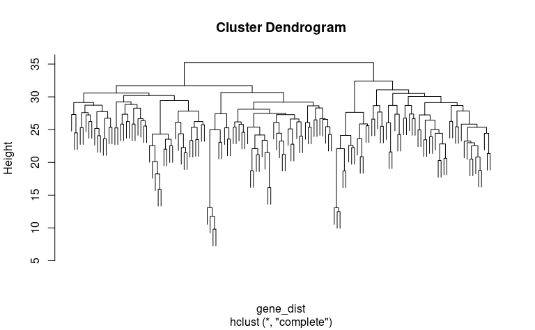

``` r
abline(h = 31, col = "brown", lwd = 2) # add horizontal line to illustrate cutting dendrogram
```

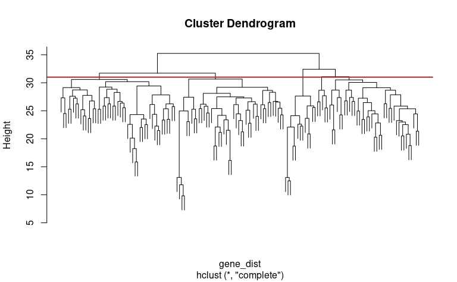

Decided on 6 clusters, use cuttree to set clusters

``` r
cutree(gene_hclust, k = 6) %>% 
  # turn the named vector into a tibble
  enframe("gene", "cluster") -> gene.cluster

gene.cluster %>% 
  group_by(cluster) %>% 
  nest() %>% 
  pull(data) %>% 
  map( pull, gene)
```

    ## [[1]]
    ##  [1] "Fn1"     "Tagln2"  "Vim"     "Fkbp1a"  "Pgk1"    "Lmna"    "S100a10"
    ##  [8] "Txn1"    "Cd36"    "Actb"    "Zyx"     "Capg"    "Tmsb10"  "Emp1"   
    ## [15] "Gpi1"    "Pycard"  "Itgam"   "Adam8"   "Ifitm6"  "Lsp1"    "Psap"   
    ## [22] "Mif"     "Lyz2"    "Jund"    "Tpm4"    "Mt1"     "Cyba"    "Lgals3" 
    ## [29] "Tpt1"    "Kctd12"  "Rps27l"  "Anxa2"   "Actg1"   "Id2"     "Crip1"  
    ## [36] "Ahnak"   "Gda"     "Pgam1"   "mt-Nd1"  "mt-Nd2"  "mt-Co1"  "mt-Co2" 
    ## [43] "mt-Atp6" "mt-Co3"  "mt-Nd3"  "mt-Nd4"  "mt-Cytb"
    ## 
    ## [[2]]
    ##  [1] "Creg1"     "Mrc1"      "Pltp"      "Cfp"       "Fcrls"     "Cd5l"     
    ##  [7] "Ecm1"      "Ptp4a2"    "Sdc3"      "Atpif1"    "Dhrs3"     "Naaa"     
    ## [13] "Ccl24"     "Eps8"      "Pld3"      "Ftl1"      "Ctsd"      "Cd81"     
    ## [19] "Cstb"      "Lyz1"      "Lamp1"     "Lpl"       "Cotl1"     "Aplp2"    
    ## [25] "Pmp22"     "Ccl9"      "Ccl6"      "Wfdc17"    "Vat1"      "Timp2"    
    ## [31] "Serpinb6a" "Ctsl"      "Calm1"     "Retnla"    "Lipa"     
    ## 
    ## [[3]]
    ##  [1] "Fcgr4"    "Fcer1g"   "Ifi207"   "Ifi204"   "Mafb"     "Fcgr1"   
    ##  [7] "Marcksl1" "Cxcl9"    "Cxcl10"   "Plac8"    "Spp1"     "Clec4a1" 
    ## [13] "Clec4a3"  "Apoe"     "Ifitm2"   "Ifitm3"   "Irf7"     "Irf8"    
    ## [19] "Ccl7"     "Ccl12"    "Slfn5"    "Ccl4"     "H3f3b"    "Tgfbi"   
    ## [25] "Zfp36l1"  "Fyb"      "Ly6e"     "Ly6a"     "Ly6c2"    "H2-K1"   
    ## [31] "Aif1"     "Lst1"     "Ms4a7"    "Ms4a4c"   "Ms4a6c"   "Ms4a6b"  
    ## [37] "Ms4a6d"  
    ## 
    ## [[4]]
    ## [1] "Thbs1" "Il1b"  "Chil3" "Napsa" "Msrb1"
    ## 
    ## [[5]]
    ## [1] "Tmsb4x"  "Gpx1"    "Gm2a"    "H2-DMa"  "H2-DMb1" "H2-Ab1"  "H2-Aa"  
    ## [8] "H2-Eb1"  "Cd74"   
    ## 
    ## [[6]]
    ##  [1] "C1qb"    "C1qc"    "C1qa"    "Pf4"     "Fcgrt"   "Folr2"   "Maf"    
    ##  [8] "Ctsb"    "Itm2b"   "Cbr2"    "Lgmn"    "Selenop" "H2-D1"

Make dataframe containing pseudotimes per cellcode

``` r
lineages %>%
  as_tibble(rownames = "cellcode") %>% 
  dplyr::rename( pseudotime = "curve1") %>% 
  drop_na() -> pseudotimes

pseudotimes
```

    ## # A tibble: 423 × 2
    ##    cellcode           pseudotime
    ##    <chr>                   <dbl>
    ##  1 AAAGAACTCTCGCGTT-1      185. 
    ##  2 AAAGTCCGTTAGGCCC-1      181. 
    ##  3 AAATGGAGTATTAAGG-1      109. 
    ##  4 AAATGGAGTTGCATAC-1      177. 
    ##  5 AAATGGATCAAATGAG-1       68.2
    ##  6 AACAAAGTCGTTACCC-1      100. 
    ##  7 AACAAGAGTCATCCCT-1       34.1
    ##  8 AACAGGGCAAACCACT-1      280. 
    ##  9 AACAGGGCAAGCACAG-1      256. 
    ## 10 AACCATGTCGAAGAAT-1      251. 
    ## # … with 413 more rows

Make dataframe containing scaled logcounts of genes per cellcode

``` r
# define function for sd scaling of count data
scale_this <- function(x){
  (x - mean(x, na.rm=TRUE)) / sd(x, na.rm=TRUE)
}

logexpr[genes,] %>% 
  as_tibble(rownames = "gene") %>% 
  pivot_longer(cols = -gene, names_to = "cellcode", values_to = "logcount") %>% 
  filter(cellcode %in% pseudotimes$cellcode) %>% 
  group_by(gene) %>% 
  mutate(scaled_counts = scale_this(logcount)) -> logcounts

logcounts
```

    ## # A tibble: 61,758 × 4
    ## # Groups:   gene [146]
    ##    gene  cellcode           logcount scaled_counts
    ##    <chr> <chr>                 <dbl>         <dbl>
    ##  1 Fn1   AAAGAACTCTCGCGTT-1     1.88        0.0847
    ##  2 Fn1   AAAGTCCGTTAGGCCC-1     2.37        0.396 
    ##  3 Fn1   AAATGGAGTATTAAGG-1     0          -1.12  
    ##  4 Fn1   AAATGGAGTTGCATAC-1     0          -1.12  
    ##  5 Fn1   AAATGGATCAAATGAG-1     3.58        1.18  
    ##  6 Fn1   AACAAAGTCGTTACCC-1     3.32        1.01  
    ##  7 Fn1   AACAAGAGTCATCCCT-1     0          -1.12  
    ##  8 Fn1   AACAGGGCAAACCACT-1     1.93        0.113 
    ##  9 Fn1   AACAGGGCAAGCACAG-1     3.17        0.913 
    ## 10 Fn1   AACCATGTCGAAGAAT-1     0          -1.12  
    ## # … with 61,748 more rows

Make combined table with pseudotimes, GAM-cluster and gene-expression

``` r
pseudotimes %>% 
  left_join(logcounts, by = "cellcode") %>% 
  left_join(gene.cluster, by = "gene") -> GAM.data

GAM.data
```

    ## # A tibble: 61,758 × 6
    ##    cellcode           pseudotime gene   logcount scaled_counts cluster
    ##    <chr>                   <dbl> <chr>     <dbl>         <dbl>   <int>
    ##  1 AAAGAACTCTCGCGTT-1       185. Fn1        1.88        0.0847       1
    ##  2 AAAGAACTCTCGCGTT-1       185. Creg1      0          -0.830        2
    ##  3 AAAGAACTCTCGCGTT-1       185. Fcgr4      1.88        1.33         3
    ##  4 AAAGAACTCTCGCGTT-1       185. Fcer1g     4.13        1.25         3
    ##  5 AAAGAACTCTCGCGTT-1       185. Tagln2     1.88        0.100        1
    ##  6 AAAGAACTCTCGCGTT-1       185. Ifi207     1.88        1.12         3
    ##  7 AAAGAACTCTCGCGTT-1       185. Ifi204     2.50        1.31         3
    ##  8 AAAGAACTCTCGCGTT-1       185. Vim        2.50       -0.259        1
    ##  9 AAAGAACTCTCGCGTT-1       185. Mrc1       0          -1.15         2
    ## 10 AAAGAACTCTCGCGTT-1       185. Thbs1      0          -0.425        4
    ## # … with 61,748 more rows

``` r
write_tsv(x = GAM.data, here("Output", "Imm_gene_clusters_pseudotime.tsv"))
```

Plot the gene(GAM)-clusters.

``` r
ggplot(GAM.data, aes(x = pseudotime, y = scaled_counts))+
  geom_smooth(aes(group =gene), se = F, color = "lightgrey", method = "gam", size = 0.75)+
  geom_smooth(method = "gam")+
  scale_x_reverse()+
  facet_wrap(~cluster, scales = "free_y")
```

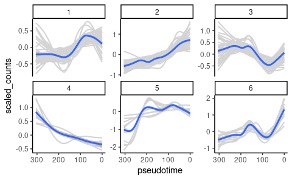

``` r
ggsave(filename = here("Figs", "immune", "Pseudotime_clusters.pdf"), width = 7,height = 4, useDingbats = F )
```

Now focus on some individual genes to visualize.

``` r
plot.genes <- c("Eps8", "Creg1", "Pld3","Serpinb6a","Ecm1","Cd5l",
                "Ly6c2", "Ms4a4c","Lyz1", "Lamp1", "Cstb", "Ctsl", 
                "Ccr2", "H2-Ab1", "Cd74", "Mrc1", "Retnla", "Fn1", 
                "Lipa", "Ctsd")

GAM.data %>% 
  filter(gene %in% plot.genes) %>% 
    ggplot(aes(x = pseudotime, y = logcount))+
      geom_point(size = 0.2, color = "grey")+ 
      geom_smooth(method = "gam")+
      scale_x_reverse()+
      facet_wrap(~gene, scales = "free_y", ncol = 4)
```

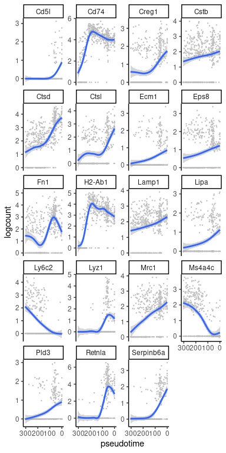

``` r
ggsave(filename = here("Figs", "immune", "Pseudotime_genes_points.pdf"), width = 4,height = 7, useDingbats = F )
```

And same plots, but without the points.

``` r
GAM.data %>% 
  filter(gene %in% plot.genes) %>% 
    ggplot(aes(x = pseudotime, y = logcount))+
      geom_smooth(method = "gam")+
      scale_x_reverse()+
      facet_wrap(~gene, scales = "free_y", ncol = 4)
```

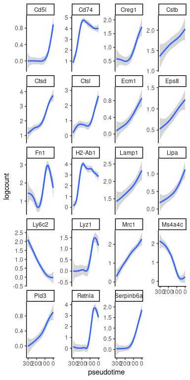

``` r
ggsave(filename = here("Figs", "immune", "Pseudotime_genes.pdf"), width = 4,height = 7, useDingbats = F )
```

## Enrichment of QPCTL-prof or -def

Finally, we’ll plot the moving sums of QPCTL-proficient and deficient
cell counts across pseudotime. Will use the `RcppRoll` package.

Add a count column, and normalize for hashtag size. Also collapse
samples by QPCTL proficient and deficient.

``` r
library(RcppRoll)

### Plot rolling average cell counts across pseudotime
seurat.obj@meta.data %>% 
  as_tibble(rownames = "cellcode") %>% 
  mutate(hash.ID = case_when(hash.ID == "Doublet" ~ HTO_maxID,
                             TRUE ~ hash.ID)) %>% 
  dplyr::select(cellcode, hash.ID) %>% 
  # Add count column and normalize to total hashtag size
  mutate(count = 1) %>% 
  group_by(hash.ID)%>%
  mutate(normalized.count = (count/sum(count))*1000 ) %>% 
  ungroup() %>% 
  # collapse genotypes
  mutate(genotype = fct_collapse(hash.ID,WT = c("HTO1", "HTO2", "HTO3"), 
                                 KO = c("HTO4", "HTO5", "HTO6"))) -> sample.counts

sample.counts
```

    ## # A tibble: 423 × 5
    ##    cellcode           hash.ID count normalized.count genotype
    ##    <chr>              <fct>   <dbl>            <dbl> <fct>   
    ##  1 AAAGAACTCTCGCGTT-1 HTO5        1            22.7  KO      
    ##  2 AAAGTCCGTTAGGCCC-1 HTO1        1            20.4  WT      
    ##  3 AAATGGAGTATTAAGG-1 HTO6        1            16.4  KO      
    ##  4 AAATGGAGTTGCATAC-1 HTO2        1            23.3  WT      
    ##  5 AAATGGATCAAATGAG-1 HTO2        1            23.3  WT      
    ##  6 AACAAAGTCGTTACCC-1 HTO5        1            22.7  KO      
    ##  7 AACAAGAGTCATCCCT-1 HTO5        1            22.7  KO      
    ##  8 AACAGGGCAAACCACT-1 HTO3        1             9.90 WT      
    ##  9 AACAGGGCAAGCACAG-1 HTO3        1             9.90 WT      
    ## 10 AACCATGTCGAAGAAT-1 HTO3        1             9.90 WT      
    ## # … with 413 more rows

Next, join with the pseudotime data, split the normalized counts to
separate columns, arrange by pseudotime and calculate the rolling sums.

``` r
sample.counts %>% 
  left_join(pseudotimes, by = "cellcode") %>% 
  pivot_wider(names_from = genotype,values_from =  normalized.count, values_fill = 0) %>% 
  arrange(desc(pseudotime))  %>%
  # Get rolling sums
  mutate(WT_sums = roll_sum(x = WT, n = 60, by = 1, align = "center", fill = NA), 
         KO_sums = roll_sum(x = KO, n = 60, by = 1, align = "center" , fill = NA)) -> rolling.sums

rolling.sums
```

    ## # A tibble: 423 × 8
    ##    cellcode           hash.ID count pseudotime    KO    WT WT_sums KO_sums
    ##    <chr>              <fct>   <dbl>      <dbl> <dbl> <dbl>   <dbl>   <dbl>
    ##  1 GTTACGAGTAGGATAT-1 HTO3        1       305.   0    9.90      NA      NA
    ##  2 CCACTTGGTTTGCCGG-1 HTO2        1       302.   0   23.3       NA      NA
    ##  3 ACCCAAATCGCAGTTA-1 HTO3        1       301.   0    9.90      NA      NA
    ##  4 TACCTCGTCTGGCCTT-1 HTO1        1       300.   0   20.4       NA      NA
    ##  5 TAATCTCAGGTTCTTG-1 HTO3        1       298.   0    9.90      NA      NA
    ##  6 TGACTCCTCGGCTGTG-1 HTO3        1       297.   0    9.90      NA      NA
    ##  7 TTCTAACCATCCGAAT-1 HTO2        1       295.   0   23.3       NA      NA
    ##  8 GTCACGGGTGAATTGA-1 HTO6        1       295.  16.4  0         NA      NA
    ##  9 CCGATCTTCTTCGATT-1 HTO3        1       293.   0    9.90      NA      NA
    ## 10 GATGACTGTCTCGGGT-1 HTO3        1       290.   0    9.90      NA      NA
    ## # … with 413 more rows

And back to long data, and plot.

``` r
rolling.sums %>% 
  pivot_longer(cols = ends_with("sums"), names_to = "QPCTL_status", values_to = "cell_count_in_window") %>% 
    ggplot(aes(x = pseudotime, y = cell_count_in_window, color = QPCTL_status))+
      scale_x_reverse()+
      geom_line(size = 1)
```

    ## Warning: Removed 118 row(s) containing missing values (geom_path).

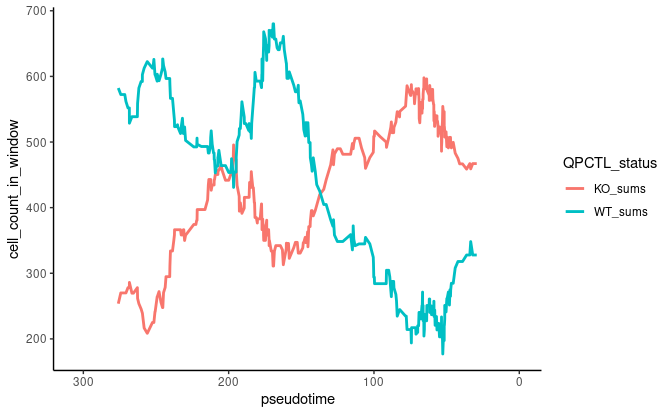

``` r
ggsave(filename =  here("Figs", "immune", "moving_window_Pseudotime.pdf"), width = 6,height = 3, useDingbats = F )
```

    ## Warning: Removed 118 row(s) containing missing values (geom_path).

## Analysis of pseudotime terminals

Another way of analysis would be to specifically look at the two
terminals of pseudotime and compare those. First check cell counts from
the samples

``` r
sample.counts %>% 
  # Add pseudotime data
  left_join(pseudotimes, by = "cellcode") %>% 
  ## subset on the right and left most terminals
  filter(dense_rank(pseudotime) <= 120 | dense_rank(dplyr::desc(pseudotime)) <= 120) %>% 
  mutate(terminal = case_when(pseudotime < 75 ~ "right",
                              pseudotime > 75 ~ "left")) %>% 
  group_by( genotype,terminal, hash.ID) %>% 
  summarise(sum.count = sum(normalized.count)) -> terminal.counts

terminal.counts
```

    ## # A tibble: 12 × 4
    ## # Groups:   genotype, terminal [4]
    ##    genotype terminal hash.ID sum.count
    ##    <fct>    <chr>    <fct>       <dbl>
    ##  1 WT       left     HTO1         224.
    ##  2 WT       left     HTO2         349.
    ##  3 WT       left     HTO3         505.
    ##  4 WT       right    HTO1         204.
    ##  5 WT       right    HTO2         256.
    ##  6 WT       right    HTO3         158.
    ##  7 KO       left     HTO4         112 
    ##  8 KO       left     HTO5         227.
    ##  9 KO       left     HTO6         311.
    ## 10 KO       right    HTO4         528 
    ## 11 KO       right    HTO5         295.
    ## 12 KO       right    HTO6         344.

And plot.

``` r
ggplot(terminal.counts, aes(x = genotype, y = sum.count))+
  geom_jitter(width = 0.2, size = 2)+
  facet_wrap(~terminal, scales = "free_y")+
  stat_summary(fun.data=mean_se,  geom="pointrange", color="blue", cex = 0.4 )
```

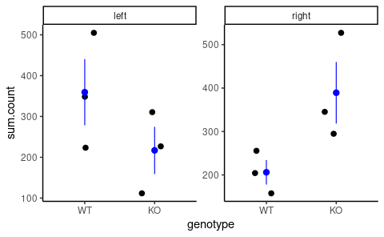

``` r
ggsave(here("Figs", "immune", "Pseudotime_terminals_bySide.pdf"), width = 3, height = 4, scale = .75, useDingbats = F)
```

And plot expression of genes of interest

``` r
GAM.data %>% 
  dplyr::filter(dense_rank(pseudotime) <= 120 | dense_rank(dplyr::desc(pseudotime)) <= 120) %>% 
  mutate(terminal = case_when(pseudotime < 75 ~ "right",
                              pseudotime > 75 ~ "left")) -> for.plot
```

``` r
for.plot %>% 
  dplyr::filter(gene %in% c("Ly6c2", "Mrc1", "Lyz1", "Lamp1", "Ms4a4c","Eps8", "Ctsd", "H2-Aa")) %>% 
  mutate(polarization = fct_recode(.$terminal, Mono = "left", Macro = "right")) %>% 
    ggplot( aes(x = polarization, y = logcount))+
      geom_violin(aes(fill = polarization))+
      geom_jitter(color = "black", size = 0.1, width = 0.25)+
      facet_wrap(~fct_relevel(gene, c("Ly6c2", "Mrc1", "Lyz1", "Lamp1", "Ms4a4c","Eps8", "Ctsd", "H2-Aa")), nrow = 2)+
      theme_classic()+
      theme(strip.background = element_blank())
```

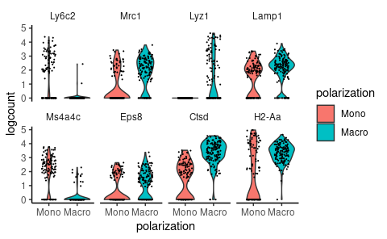

``` r
ggsave(here("Figs", "immune", "Vln_plot_Phenotypes_terminals.pdf"), width = 5, height = 2.5, useDingbats = F)
```
