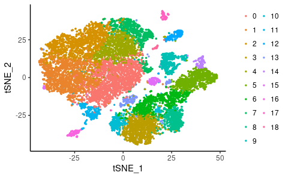
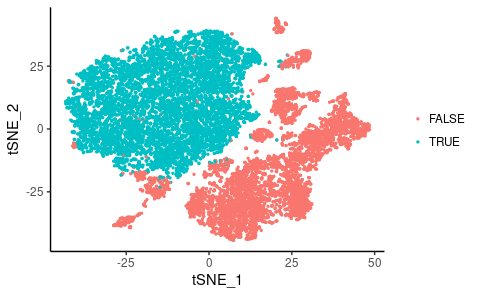
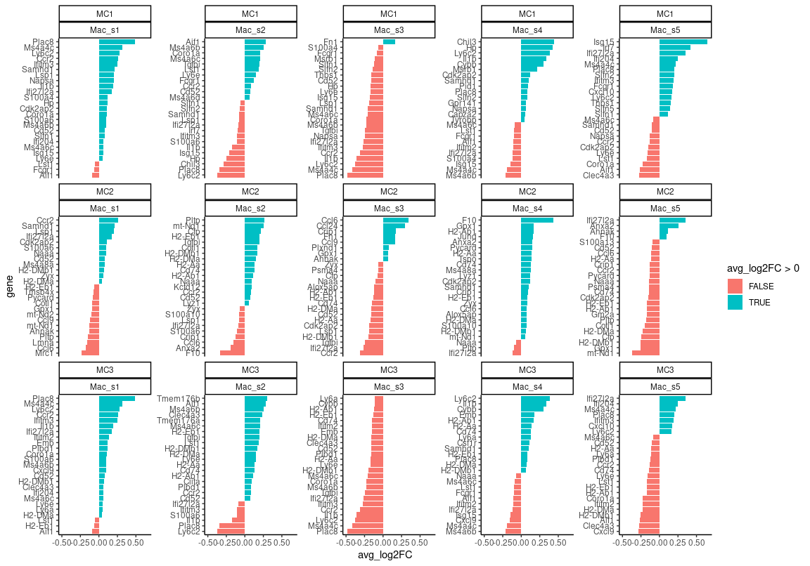
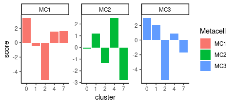
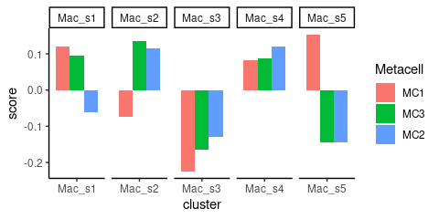

Compare scRNAseq data with external dataset
================
Kaspar Bresser
15/01/2022

-   [Import and reformat data](#import-and-reformat-data)
-   [Find markers myeloid clusters](#find-markers-myeloid-clusters)
-   [Compare sets](#compare-sets)

One of the referee’s was interested in how the myeloid MetaCells that we
describe in our dataset relate to myeloid phenotypes found in other
studies. Here I’ll try to investigate this.
[This](https://www.ncbi.nlm.nih.gov/geo/query/acc.cgi?acc=GSE119352)
study scRNA sequenced TMEs from induced mouse tumors that were subjected
to various ICB treatments, will have a look if we can use this data for
a comparison to our cell states.

We’ll use the log2 gene-enrichment values to compare to. Load in
necessary packages and get the lfp table

# Import and reformat data

The authors uploaded a meta data table with cell annotations, and the
10x files for each of the treatments. Note that the cluster labels no
not correspond to the published manuscript. THe myeloid cells are in the
upper-left cluster, i.e. GraphCluster 0, 1, 2, 4 and 7.

``` r
meta <- read_tsv(here("Data", "ICB_data", "GSE119352_scRNAseq_CD45_meta_data.tsv"))

meta
```

    ## # A tibble: 14,493 × 5
    ##    ...1             tSNE_1 tSNE_2 GraphCluster Sample 
    ##    <chr>             <dbl>  <dbl>        <dbl> <chr>  
    ##  1 AAACATACAGCGTT-1  -1.90 -29.0            10 Control
    ##  2 AAACATACATTTCC-1 -10.6   -6.27            0 Control
    ##  3 AAACATACCCAACA-1 -22.1   -6.00            0 Control
    ##  4 AAACATACCCTTGC-1 -14.4   -6.24            1 Control
    ##  5 AAACATACTATGGC-1  -4.28 -10.3             0 Control
    ##  6 AAACATTGCAATCG-1   2.31   2.30            0 Control
    ##  7 AAACATTGCTCCCA-1 -25.4    6.91            1 Control
    ##  8 AAACATTGCTTGGA-1 -23.8   -6.67            1 Control
    ##  9 AAACATTGGGTATC-1 -35.7   10.5             1 Control
    ## 10 AAACATTGGTTTGG-1 -34.0   11.0             1 Control
    ## # … with 14,483 more rows

``` r
ggplot(meta, aes(tSNE_1, tSNE_2, color = as.factor(GraphCluster)))+
  geom_point(size = 0.5)+
  theme(legend.title = element_text(size = 0))+
  guides(color=guide_legend(ncol=2))
ggplot(meta, aes(tSNE_1, tSNE_2, color = as.factor(GraphCluster %in% c(0,1,2,4,7))))+
  geom_point(size = 0.5)+
  theme(legend.title = element_text(size = 0))
```



Next import the 10x data. The authors uploaded separate files for each
ICB treatment group. I’ve stored these in the folders
`c("control", "PD1", "CTLA4", "combined")`. In the metadata the
cellcodes from each of the groups are identified by a numeric suffix.
Defined a function `import_10x` to read the 10x files from a folder, and
add a numeric suffix, then create a Seurat object. Used `purrr:map2` to
apply this function for each dataset, then `merge` the 4 objects into a
single Seurat object.

``` r
import_10x <- function(directory, n){
  
  tmp <- Read10X(here("Data", "ICB_data", directory), strip.suffix = T)
  tmp@Dimnames[[2]] <- paste0(tmp@Dimnames[[2]], paste0("-", n))
  tmp <- CreateSeuratObject(tmp)
  
  tmp
}

samples <- c("control", "PD1", "CTLA4", "combined")
suffixes <- 1:4

seurat.list <- map2(samples, suffixes, import_10x)

seurat.obj <- merge(seurat.list[[1]], seurat.list[2:4])
rm(seurat.list)

seurat.obj
```

    ## An object of class Seurat 
    ## 27998 features across 14618 samples within 1 assay 
    ## Active assay: RNA (27998 features, 0 variable features)

# Find markers myeloid clusters

Subset on myeloid clusters and normalize the data.

``` r
meta %>% 
  filter(GraphCluster %in%  c(0,1,2,4,7)) %>% 
  pull(...1) -> myeloid.cells


seurat.obj <- subset(seurat.obj, cells = myeloid.cells)

seurat.obj <- NormalizeData(seurat.obj, normalization.method = "CLR")

seurat.obj
```

    ## An object of class Seurat 
    ## 27998 features across 8212 samples within 1 assay 
    ## Active assay: RNA (27998 features, 0 variable features)

Add cluster labels and find markers for each cluster

``` r
meta %>% 
  filter(GraphCluster %in% c(0,1,2,4,7)) %>% 
  select(...1, GraphCluster) %>% 
  deframe() -> cluster.info
seurat.obj <- AddMetaData(seurat.obj, cluster.info, col.name = "GraphCluster")

seurat.obj <- SetIdent(seurat.obj, value = "GraphCluster")
myeloid.markers <- FindAllMarkers(seurat.obj, min.pct = 0.2, logfc.threshold = 0,  only.pos = F)

(myeloid.markers <- as_tibble(myeloid.markers))
```

    ## # A tibble: 7,162 × 7
    ##        p_val avg_log2FC pct.1 pct.2 p_val_adj cluster gene 
    ##        <dbl>      <dbl> <dbl> <dbl>     <dbl> <fct>   <chr>
    ##  1 0              0.492 0.942 0.644 0         0       Plac8
    ##  2 1.11e-302     -0.592 0.157 0.596 3.11e-298 0       Cd63 
    ##  3 2.41e-301     -0.693 0.182 0.62  6.74e-297 0       Arg1 
    ##  4 1.69e-267     -0.405 0.781 0.919 4.73e-263 0       Ctsb 
    ##  5 2.38e-265     -0.468 0.383 0.742 6.66e-261 0       Ctsl 
    ##  6 1.36e-251     -0.564 0.119 0.514 3.82e-247 0       Ms4a7
    ##  7 1.10e-225     -0.444 0.551 0.801 3.09e-221 0       Lgmn 
    ##  8 9.22e-218     -0.491 0.462 0.789 2.58e-213 0       C1qa 
    ##  9 9.49e-218     -0.586 0.068 0.426 2.66e-213 0       Pf4  
    ## 10 1.09e-216     -0.246 1     1     3.05e-212 0       Ftl1 
    ## # … with 7,152 more rows

# Compare sets

We’ll focus on myeloid MC1, MC2 and MC3 from our data, for which we
observed the largest shifts in the TME of QPCTL KO versus WT mice. Join
the data with the DE data and retain only significantly DE genes.

``` r
lfp %>% 
  as_tibble( rownames = "gene") %>% 
  select(gene, `1` , `2`, `3`) %>% 
  set_names("gene", "MC1", "MC2", "MC3") %>%
  pivot_longer(-gene, names_to = "Metacell", values_to = "lfp") %>% 
  inner_join(myeloid.markers) %>%  
  filter(p_val_adj < 0.05)  -> combined.data

combined.data
```

    ## # A tibble: 14,355 × 9
    ##    gene  Metacell     lfp    p_val avg_log2FC pct.1 pct.2 p_val_adj cluster
    ##    <chr> <chr>      <dbl>    <dbl>      <dbl> <dbl> <dbl>     <dbl> <fct>  
    ##  1 Tcea1 MC1       0.154  4.99e- 8    -0.0536 0.176 0.236  1.40e- 3 2      
    ##  2 Tcea1 MC2      -0.0920 4.99e- 8    -0.0536 0.176 0.236  1.40e- 3 2      
    ##  3 Tcea1 MC3       0.0568 4.99e- 8    -0.0536 0.176 0.236  1.40e- 3 2      
    ##  4 Tram1 MC1       0.425  1.78e-10    -0.0699 0.202 0.271  4.98e- 6 2      
    ##  5 Tram1 MC1       0.425  8.48e- 9     0.0635 0.326 0.244  2.37e- 4 4      
    ##  6 Tram1 MC2       0.156  1.78e-10    -0.0699 0.202 0.271  4.98e- 6 2      
    ##  7 Tram1 MC2       0.156  8.48e- 9     0.0635 0.326 0.244  2.37e- 4 4      
    ##  8 Tram1 MC3       0.211  1.78e-10    -0.0699 0.202 0.271  4.98e- 6 2      
    ##  9 Tram1 MC3       0.211  8.48e- 9     0.0635 0.326 0.244  2.37e- 4 4      
    ## 10 Rpl7  MC1       0.383  4.95e-20    -0.0847 0.844 0.87   1.38e-15 0      
    ## # … with 14,345 more rows

Now filter the marker genes of each cluster for the top genes found
inthe MetaCells. Then plot the differential expression of these genes in
the different clusters

``` r
combined.data %>% 
  group_by(cluster, Metacell) %>% 
  slice_max(lfp, n = 25) %>% 
  mutate(gene = reorder_within(gene, by = avg_log2FC, within = list(cluster, Metacell)),
         cluster = fct_recode(cluster, Mac_s1 = "0", Mac_s2 = "1", Mac_s3 = "2", Mac_s4 = "4", Mac_s5 = "7")) %>% 
  ggplot(aes(x = gene, y = avg_log2FC, fill = avg_log2FC > 0))+
    geom_bar(stat = "identity")+
    coord_flip()+
    scale_x_reordered()+
    facet_wrap(Metacell~cluster, scales = "free_y", nrow = 3)
```



``` r
ggsave(here("Figs", "immune", "compare_mac_waterfalls.pdf"), width = 8, height = 7, scale = 1.4)
```

Plot this data as sum scores.

``` r
combined.data %>% 
  group_by(cluster, Metacell) %>% 
  slice_max(lfp, n = 25) %>% 
  summarise(score = sum((avg_log2FC))) %>% 
  ggplot(aes(cluster, score, fill = Metacell))+
  geom_bar(stat = "identity", position = "dodge")+
  facet_wrap(~Metacell, scales = "free")
```



Can also use these top genes to calculate a similarity score. To do this
I perform a weighted sampling of the avg_log2FC values (weighted by the
lfp values of those genes, putting more prominence on genes that were
more enriched). Similarity score is defined as the median of those
sampled values.

``` r
combined.data %>% 
  group_by(cluster, Metacell) %>% 
  slice_max(lfp, n = 25) %>% 
  slice_sample(n = 10000, weight_by = lfp, replace = T) %>% 
  summarise(score = median((avg_log2FC))) %>% 
  mutate(Metacell = factor(Metacell, levels = c("MC1", "MC3", "MC2")),
         cluster = fct_recode(cluster, Mac_s1 = "0", Mac_s2 = "1", Mac_s3 = "2", Mac_s4 = "4", Mac_s5 = "7")) %>% 
    ggplot(aes(cluster, score, fill = Metacell))+
      geom_bar(stat = "identity", position = "dodge")+
      facet_wrap(~cluster, nrow = 1, scales = "free_x")
```



``` r
ggsave(here("Figs", "immune", "compare_mac_scores.pdf"), width = 4, height = 2, scale = 1.2)
```
