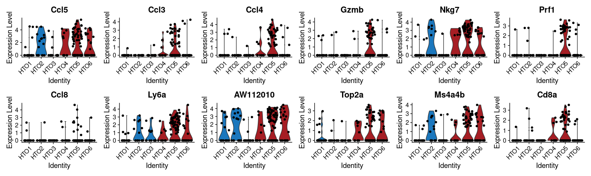

Lymphocyte compartment analysis
================
Kaspar Bresser
20/10/2021

-   [Subset and DE testing](#subset-and-de-testing)
-   [Plot data](#plot-data)

In the immune compartment of the scRNAseq dataset, we identified a
lymphocyte MetaCell (MetaCell 6). We observe no difference in the
quantities of these cells. In the analysis below I’ll check if these
cells are transcriptionally different.

Import packages and data needed for the analysis.

## Subset and DE testing

``` r
lympoid.cells <- names(mc@mc[mc@mc == 6])

seurat.obj <- subset(seurat.obj, cells = lympoid.cells)

seurat.obj <- NormalizeData(seurat.obj)
```

Collapse hashtags together for DE comparisons between QPCTL-proficient
and QPCTL-deficient

``` r
seurat.obj@meta.data %>% 
  as_tibble(rownames = "cellcode") %>% 
  mutate(hash.ID = case_when(hash.ID == "Doublet" ~ HTO_maxID,
                             TRUE ~ hash.ID)) -> seurat.obj@meta.data

seurat.obj@meta.data %>% 
  dplyr::select(cellcode, hash.ID) %>% 
  deframe %>% 
  as.factor %>% 
  fct_collapse(WT = c("HTO1", "HTO2", "HTO3"), KO = c("HTO4", "HTO5", "HTO6")) -> genotype

str(genotype)
```

    ##  Factor w/ 2 levels "WT","KO": 1 2 2 1 2 2 1 2 1 2 ...
    ##  - attr(*, "names")= chr [1:160] "AAAGGTATCAAACCCA-1" "AACAAAGTCTGAATGC-1" "AACCACAGTCACTCTC-1" "AACCATGGTGTCACAT-1" ...

``` r
seurat.obj <- AddMetaData(object = seurat.obj, metadata = genotype, col.name = "genotype")
```

And test for differentially expressed genes.

``` r
Idents(seurat.obj) <- "genotype"
marks <- FindMarkers(object = seurat.obj, ident.1 = 'KO', ident.2 = 'WT', 
                     logfc.threshold = 0, test.use = "wilcox", min.pct = 0.1, slot = "counts")
```

And save data.

``` r
marks <- as_tibble(marks, rownames = "gene")

arrange(marks, desc(avg_log2FC))
```

    ## # A tibble: 4,733 × 6
    ##    gene         p_val avg_log2FC pct.1 pct.2 p_val_adj
    ##    <chr>        <dbl>      <dbl> <dbl> <dbl>     <dbl>
    ##  1 Ccl5     0.00279        1.68  0.524 0.309         1
    ##  2 Ccl3     0.0000627      1.46  0.305 0.036         1
    ##  3 Ccl4     0.0000779      1.29  0.381 0.091         1
    ##  4 Gzmb     0.00145        1.23  0.324 0.091         1
    ##  5 Nkg7     0.000324       1.07  0.514 0.218         1
    ##  6 Prf1     0.000358       1.06  0.324 0.073         1
    ##  7 Ccl8     0.107          0.928 0.143 0.055         1
    ##  8 Ly6a     0.000402       0.917 0.552 0.309         1
    ##  9 AW112010 0.000791       0.869 0.619 0.364         1
    ## 10 Top2a    0.00157        0.823 0.39  0.145         1
    ## # … with 4,723 more rows

``` r
write_tsv(marks, here("Output", "Imm_Lymphoid_DEtest.tsv"))
```

## Plot data

Plot the top 12 enriched genes in QPCTL-deficient TMEs (For
supplementary figure).

``` r
marks %>% 
  slice_max(order_by = avg_log2FC, n = 12) %>% 
  pull(gene) -> genes

colors <- c("#1B77BD","#1B77BD","#1B77BD","#A61E24","#A61E24","#A61E24")

Idents(seurat.obj) <- "hash.ID"
VlnPlot(seurat.obj, features = genes, ncol = 6, cols = colors, pt.size = 1.5)
```



Plot some selected genes (for main figure).

``` r
genes <- c("Top2a", "Mki67", "Birc5", "Eif5a", "Ifng", "Klrd1", "Il2rb", "Tnfrsf9")

VlnPlot(seurat.obj, features = genes, ncol = 4, pt.size = 1.5 ,cols = colors)
```


