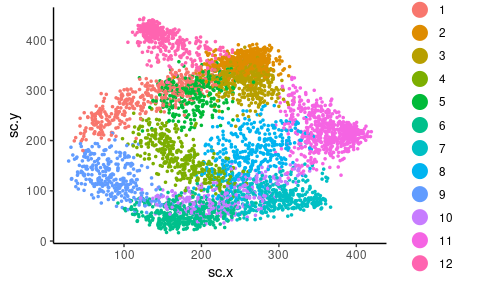
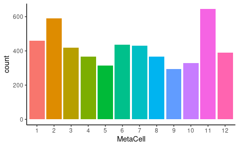
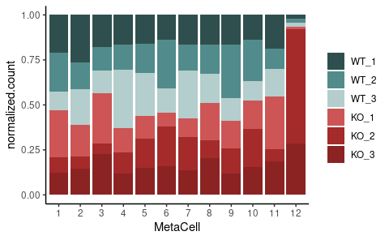

General analyses tumor cells
================
Kaspar Bresser
20/10/2021

-   [MetaCell 2D projection](#metacell-2d-projection)
-   [Cell counts in experiment](#cell-counts-in-experiment)
-   [MetaCell composition](#metacell-composition)

Below some general visualizations of the tumor cell compartment of the
scRNAseq data.

## MetaCell 2D projection

Import the MetaCell object and the 2D coordinates.

``` r
scdb_init(here("Data", "Metacell_files_tumor"))
mc <- scdb_mc("QPCTL_Tum_MC2")

str(mc)
```

    ## Formal class 'tgMCCov' [package "metacell"] with 10 slots
    ##   ..@ mc        : Named int [1:5042] 2 8 10 4 8 6 11 3 6 6 ...
    ##   .. ..- attr(*, "names")= chr [1:5042] "AAACCCACAATCAAGA-1" "AAACCCAGTCCCTGAG-1" "AAACCCATCGTCGCTT-1" "AAACCCATCTTCGATT-1" ...
    ##   ..@ outliers  : chr [1:21] "ACCTACCGTTAAAGTG-1" "ACGGTTAGTTCCACGG-1" "AGCCAATAGGTACTGG-1" "AGCCAGCCAGGAACCA-1" ...
    ##   ..@ cell_names: chr [1:5063] "AAACCCACAATCAAGA-1" "AAACCCAGTCCCTGAG-1" "AAACCCATCGTCGCTT-1" "AAACCCATCTTCGATT-1" ...
    ##   ..@ mc_fp     : num [1:13864, 1:12] 1.113 1.015 0.998 0.948 0.972 ...
    ##   .. ..- attr(*, "dimnames")=List of 2
    ##   .. .. ..$ : chr [1:13864] "Mrpl15" "Lypla1" "Tcea1" "Atp6v1h" ...
    ##   .. .. ..$ : chr [1:12] "1" "2" "3" "4" ...
    ##   ..@ e_gc      : num [1:13864, 1:12] 1.45e-04 3.04e-05 9.99e-05 4.25e-05 2.87e-05 ...
    ##   .. ..- attr(*, "dimnames")=List of 2
    ##   .. .. ..$ : chr [1:13864] "Mrpl15" "Lypla1" "Tcea1" "Atp6v1h" ...
    ##   .. .. ..$ : chr [1:12] "1" "2" "3" "4" ...
    ##   ..@ cov_gc    : num [1:13864, 1:12] 0.904 0.485 0.839 0.587 0.454 ...
    ##   .. ..- attr(*, "dimnames")=List of 2
    ##   .. .. ..$ : chr [1:13864] "Mrpl15" "Lypla1" "Tcea1" "Atp6v1h" ...
    ##   .. .. ..$ : chr [1:12] "1" "2" "3" "4" ...
    ##   ..@ n_bc      : int [1, 1:12] 460 591 420 366 315 437 430 368 293 329 ...
    ##   .. ..- attr(*, "dimnames")=List of 2
    ##   .. .. ..$ : chr "1"
    ##   .. .. ..$ : chr [1:12] "1" "2" "3" "4" ...
    ##   ..@ annots    : Named int [1:12] 2 7 9 1 11 3 6 8 10 12 ...
    ##   .. ..- attr(*, "names")= chr [1:12] "1" "2" "3" "4" ...
    ##   ..@ colors    : chr [1:12] "#440154FF" "#482173FF" "#433E85FF" "#38598CFF" ...
    ##   ..@ color_key :'data.frame':   0 obs. of  0 variables

``` r
MC.graph <- scdb_mc2d("QPCTL_Tum_MC2")

coords <- tibble( cellcode = names(MC.graph@sc_y),
                  sc.x = MC.graph@sc_x,
                  sc.y = MC.graph@sc_y)
coords
```

    ## # A tibble: 5,042 × 3
    ##    cellcode            sc.x  sc.y
    ##    <chr>              <dbl> <dbl>
    ##  1 AAACCCACAATCAAGA-1  242. 361. 
    ##  2 AAACCCAGTCCCTGAG-1  296. 237. 
    ##  3 AAACCCATCGTCGCTT-1  203. 103. 
    ##  4 AAACCCATCTTCGATT-1  223. 140. 
    ##  5 AAACGAAAGGACGCAT-1  282. 203. 
    ##  6 AAACGAACATATCTGG-1  180.  44.5
    ##  7 AAACGAAGTCACTACA-1  330. 204. 
    ##  8 AAACGAAGTGCAGATG-1  241. 353. 
    ##  9 AAACGAATCGTTAGTG-1  167.  33.8
    ## 10 AAACGCTAGAATGTTG-1  184.  62.0
    ## # … with 5,032 more rows

Add the MetaCell identities to the coordinate data, and plot the 2D
projection.

``` r
str(mc@mc)
```

    ##  Named int [1:5042] 2 8 10 4 8 6 11 3 6 6 ...
    ##  - attr(*, "names")= chr [1:5042] "AAACCCACAATCAAGA-1" "AAACCCAGTCCCTGAG-1" "AAACCCATCGTCGCTT-1" "AAACCCATCTTCGATT-1" ...

``` r
mc@mc %>% 
  enframe(name = "cellcode", value = "MetaCell") %>% 
  inner_join(coords) %>% 
  mutate(MetaCell = as.factor(MetaCell)) %>% 
    ggplot( aes(x = sc.x, y = sc.y, color = MetaCell))+ 
      geom_point(size = .6)+
      theme_classic()+ 
      guides(color = guide_legend(override.aes = list(size = 5)))
```



``` r
ggsave(filename = here("Figs", "tumor", "general_2d_proj_MCs.pdf"), device = "pdf", width = 4,height = 3.2)
```

## Cell counts in experiment

Plot the number of cells in each MetaCell.

``` r
mc@mc %>% 
  enframe(name = "cellcode", value = "MetaCell") %>% 
  mutate(MetaCell = as.factor(MetaCell)) %>% 
    ggplot(aes(x = MetaCell, fill = MetaCell))+
      geom_bar(stat = "count")+
      theme_classic()+
      theme(legend.position = "none")
```



``` r
ggsave(filename = here("Figs", "tumor", "general_cell_counts.pdf"), width = 4,height = 2, scale = 1.2)
```

## MetaCell composition

We profiled 3 QPCTL-KO TMEs and 3 QPCTL-WT TMEs. Plot the sample
composition of each MetaCell. The hashtag info is in the mat object.

``` r
mat.obj <- scdb_mat("QPCTL_exp_Tum")

mat.obj@cell_metadata %>% 
  select(new_hash.ID) %>% 
  as_tibble(rownames = "cellcode") %>% 
  filter(str_detect(new_hash.ID, "HTO")) %>% 
  mutate(sample = fct_recode(new_hash.ID, WT_1 = "HTO1", WT_2 = "HTO2", WT_3 = "HTO3",
                                          KO_1 = "HTO4", KO_2 = "HTO5", KO_3 = "HTO6")) -> hashtags

hashtags
```

    ## # A tibble: 8,704 × 3
    ##    cellcode           new_hash.ID sample
    ##    <chr>              <chr>       <fct> 
    ##  1 AAACCCAAGTGATGGC-1 HTO4        KO_1  
    ##  2 AAACCCACAATCAAGA-1 HTO3        WT_3  
    ##  3 AAACCCAGTCCCTGAG-1 HTO4        KO_1  
    ##  4 AAACCCATCGTCGCTT-1 HTO1        WT_1  
    ##  5 AAACCCATCTTCGATT-1 HTO1        WT_1  
    ##  6 AAACGAAAGGACGCAT-1 HTO6        KO_3  
    ##  7 AAACGAACAATACAGA-1 HTO1        WT_1  
    ##  8 AAACGAACATATCTGG-1 HTO6        KO_3  
    ##  9 AAACGAAGTCACTACA-1 HTO2        WT_2  
    ## 10 AAACGAAGTGCAGATG-1 HTO4        KO_1  
    ## # … with 8,694 more rows

Combine with MetaCells and normalize within samples.

``` r
mc@mc %>% 
  enframe(name = "cellcode", value = "MetaCell") %>% 
  inner_join(hashtags) %>% 
  count(MetaCell, sample) %>%
  group_by(sample)%>%
  mutate(normalized.count = (n/sum(n))*1000 ) %>% 
  mutate(MetaCell = as.factor(MetaCell) ) -> sample.counts

sample.counts
```

    ## # A tibble: 72 × 4
    ## # Groups:   sample [6]
    ##    MetaCell sample     n normalized.count
    ##    <fct>    <fct>  <int>            <dbl>
    ##  1 1        WT_1      84            110. 
    ##  2 1        WT_2      51            113. 
    ##  3 1        WT_3      29             53.5
    ##  4 1        KO_1     182            137. 
    ##  5 1        KO_2      25             44.2
    ##  6 1        KO_3      89             63.8
    ##  7 2        WT_1     139            182. 
    ##  8 2        WT_2      47            104. 
    ##  9 2        WT_3      75            138. 
    ## 10 2        KO_1     161            121. 
    ## # … with 62 more rows

And plot

``` r
ggplot(sample.counts, aes(fill = sample, y=normalized.count, x=MetaCell)) + 
  geom_bar( stat="identity", position = "fill")+
  scale_fill_manual(values=c("#2F4F4F", "#528B8B", "#B4CDCD", "#CD5555","#A52A2A", "#8B2323"))+
  theme(legend.title = element_blank())
```



``` r
ggsave(filename = here("Figs", "tumor", "general_sample_compostition.pdf"), width = 4, height = 3, useDingbats=FALSE)
```
