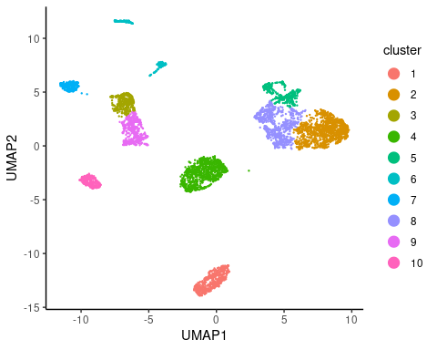
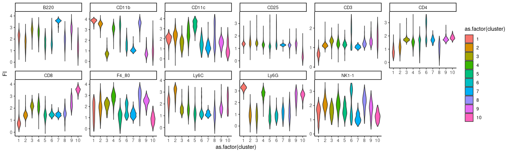
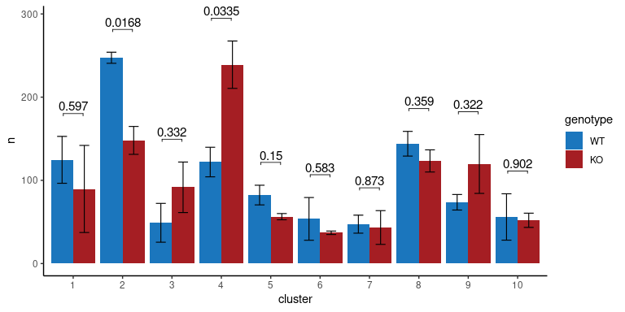

Analysis flow cytometry data - B16F10 tumors
================
Kaspar Bresser
20/10/2021

-   [Import and prep data](#import-and-prep-data)
-   [UMAP](#umap)
-   [Compare cluster frequencies](#compare-cluster-frequencies)

Below the unbiased flow analysis of B16F10 tumor samples from QPCTL-WT
and QPCTL-KO mice. Samples were already pre-gated on CD45+ cells.

Import the necessary packages

## Import and prep data

Read in the fcs files using the
[flowCore](https://bioconductor.org/packages/release/bioc/html/flowCore.html)
package.

``` r
fset <- read.flowSet( path = here("Data", "tumor") )

fset
```

    ## A flowSet with 10 experiments.
    ## 
    ## column names(22): FSC-A FSC-H ... FJComp-YG[E] 585_15-A Time

Down-sample to 5000 cells from each file.

``` r
set.seed(667)

dsFilt <- sampleFilter(size = 1000, filterId="dsFilter")
filter.result <- flowCore::filter(fset, dsFilt)
fset <- Subset(fset, filter.result)
```

We’ll perform a logicle transformation to the fluorescence channels. We
can use 1 sample to calculate the transformation, and then apply it to
all the rest.

``` r
toTrans <- as.character(grep(pattern = "FJ", x = colnames(fset), value = T ))
toTrans
```

    ##  [1] "FJComp-BL[A] 685_35-A" "FJComp-BL[B] 525_50-A" "FJComp-R[A] 780_60-A" 
    ##  [4] "FJComp-R[B] 710_50-A"  "FJComp-R[C] 670_14-A"  "FJComp-UV[A] 819_44-A"
    ##  [7] "FJComp-UV[B] 740_35-A" "FJComp-UV[E] 379_34-A" "FJComp-V[A] 780_60-A" 
    ## [10] "FJComp-V[B] 710_50-A"  "FJComp-V[C] 450_50-A"  "FJComp-YG[A] 780_60-A"
    ## [13] "FJComp-YG[C] 670_30-A" "FJComp-YG[D] 610_20-A" "FJComp-YG[E] 585_15-A"

``` r
lgcl <- estimateLogicle(fset@frames$`export_20191216 TME DAY2_Tum_M1_CD45+.fcs`, channels =  toTrans)
trans.fset <- transform(fset, lgcl)
```

Finally, extract to a long dataframe. Use idInfo argument extracts
shorthand sample name from fcs file name, see documentation for details.
We’ll perform the analysis on 3 samples from both QPCTL deficient and
proficient tumors. Also, add a cell_id column.

``` r
trans.fset %>%  
  flowSet2LongDf( idInfo =  list("Sample" = "export_20191216 TME DAY2_Tum_|_CD45\\+\\.fcs")) %>% 
  rownames_to_column("cell_id") %>% 
  dplyr::filter(grepl('5|7|10|4|6|8', Sample)) %>% 
  as_tibble() -> flow.data

flow.data
```

    ## # A tibble: 6,000 × 25
    ##    cell_id   FSC.A  FSC.H   FSC.W   SSC.A  SSC.H  SSC.W FJComp.BL.A..685_35.A
    ##    <chr>     <dbl>  <dbl>   <dbl>   <dbl>  <dbl>  <dbl>                 <dbl>
    ##  1 1001    133520. 105575  82883. 180273. 152806 77316.                 1.43 
    ##  2 1002    172482  136782  82641. 169816. 139688 79671.                 0.778
    ##  3 1003     48092.  28303 111358. 124566.  88047 92718.                 2.31 
    ##  4 1004     27578.  18660  96855. 229130. 162059 92659.                 2.45 
    ##  5 1005     50532.  40951  80870.  84826.  70791 78529.                 0.925
    ##  6 1006     38938.  29946  85216. 179544. 143525 81983.                 2.37 
    ##  7 1007    113374.  95769  77583. 100604.  83245 79202.                 0.610
    ##  8 1008    160674. 117040  89969. 210047. 161592 85188.                 1.74 
    ##  9 1009     61239.  47733  84080. 149095. 121466 80443.                 1.07 
    ## 10 1010     61371.  49089  81933. 240403. 184366 85455.                 2.74 
    ## # … with 5,990 more rows, and 17 more variables: FJComp.BL.B..525_50.A <dbl>,
    ## #   FJComp.R.A..780_60.A <dbl>, FJComp.R.B..710_50.A <dbl>,
    ## #   FJComp.R.C..670_14.A <dbl>, FJComp.UV.A..819_44.A <dbl>,
    ## #   FJComp.UV.B..740_35.A <dbl>, FJComp.UV.E..379_34.A <dbl>,
    ## #   FJComp.V.A..780_60.A <dbl>, FJComp.V.B..710_50.A <dbl>,
    ## #   FJComp.V.C..450_50.A <dbl>, FJComp.YG.A..780_60.A <dbl>,
    ## #   FJComp.YG.C..670_30.A <dbl>, FJComp.YG.D..610_20.A <dbl>, …

And save dataframe for later use.

``` r
write_tsv(flow.data, here("Output", "tumor_data.tsv"))
```

## UMAP

Lets subset the data for the markers that we want to use for the UMAP.

First get the markers available in the dataset

``` r
trans.fset@frames$`export_20191216 TME DAY2_Tum_M1_CD45+.fcs`@parameters@data %>% 
  na.omit() %>% 
  pull(desc) -> markers

markers
```

    ##    $P7S    $P8S    $P9S   $P10S   $P12S   $P13S   $P14S   $P15S   $P16S   $P18S 
    ##   "CD8"   "CD3" "F4_80"  "Ly6G"   "CD4"  "B220"  "CD45" "CD11b"  "Ly6C" "NK1-1" 
    ##   $P19S   $P20S   $P21S 
    ##  "7AAD" "CD11c"  "CD25"

Then select markers, drop other columns, and rename according to
proteins

``` r
flow.data %>% 
  dplyr::select(starts_with("FJ"), Sample, cell_id ) %>% 
  dplyr::select(-c(5,11)) %>% # drop channels that were not used
  setNames(., c(markers, "Sample", "cell_id")) %>% # rename columns 
  dplyr::select(!one_of("CD45", "7AAD")) -> flow.data # drop irrelevant markers

flow.data
```

    ## # A tibble: 6,000 × 13
    ##      CD8   CD3   F4_80   Ly6G   CD4  B220 CD11b  Ly6C `NK1-1`   CD11c   CD25
    ##    <dbl> <dbl>   <dbl>  <dbl> <dbl> <dbl> <dbl> <dbl>   <dbl>   <dbl>  <dbl>
    ##  1 1.43  0.943 -0.186   2.87  0.831  2.36 3.87  2.70    1.42  -0.0880 0.576 
    ##  2 0.778 0.914  0.108   3.09  0.938  2.53 4.00  1.52    1.76   1.33   1.09  
    ##  3 2.31  1.27   1.78   -0.399 0.987  2.43 3.78  3.16    1.54  -0.663  0.0786
    ##  4 2.45  1.52   2.55    0.315 1.45   3.10 0.973 1.49    1.26   0.621  1.09  
    ##  5 0.925 0.703 -0.0622  3.07  0.435  1.62 3.82  2.09    1.59   1.49   1.18  
    ##  6 2.37  1.31   2.87    2.77  1.46   2.79 3.01  1.65    0.756  2.26   1.06  
    ##  7 0.610 0.616  0.503   3.26  0.493  2.61 3.99  2.01    1.95   1.50   1.52  
    ##  8 1.74  1.46  -0.289  -0.232 0.203  2.51 4.03  0.154   2.52   3.01   1.18  
    ##  9 1.07  0.802  0.566   3.22  0.562  2.24 3.80  2.57    1.68   1.84   1.28  
    ## 10 2.74  1.58   3.06    3.15  1.28   2.63 3.50  1.32    2.70   2.41   1.22  
    ## # … with 5,990 more rows, and 2 more variables: Sample <chr>, cell_id <chr>

Now we can perform the UMAP, and extract the coordinates as a dataframe.

``` r
set.seed(667)

reducU <- umap::umap(flow.data[1:11])

umap_plot_df <- as_tibble(data.frame(reducU$layout))

umap_plot_df
```

    ## # A tibble: 6,000 × 2
    ##         X1     X2
    ##      <dbl>  <dbl>
    ##  1 -1.06   -13.4 
    ##  2 -1.45   -13.4 
    ##  3  6.83     1.80
    ##  4 -7.12     4.14
    ##  5 -1.09   -13.4 
    ##  6 -1.55    -2.20
    ##  7 -1.25   -13.5 
    ##  8  6.17     5.16
    ##  9 -0.829  -13.6 
    ## 10 -0.0770  -2.82
    ## # … with 5,990 more rows

Now use those coordinates to perform hierarchical clustering.

``` r
hc.norm = hclust(dist(umap_plot_df), method = "ward.D")
```

Add a ‘cluster’ column to the flow data, cutting the tree at 10
clusters.

``` r
flow.data$cluster = factor(cutree(hc.norm, 10))
```

Add the coordinates to the flow data and plot the clusters

``` r
flow.data %>% 
  bind_cols(umap_plot_df) %>% 
    ggplot( aes( x = X1, y = X2, color = cluster)) +
      geom_point(size = 0.2) + 
      guides(color = guide_legend(override.aes = list(size = 4)))+
      theme_classic()+
      labs(x = "UMAP1", y = "UMAP2")
```



``` r
ggsave( here("Figs", "Tumor_UMAP_clust.pdf"), width = 4.5, height = 4)
```

Plot the marker expression per cluster.

``` r
flow.data %>% 
  gather("marker", "FI", -c(Sample, cluster, cell_id)) %>% 
    ggplot( aes(x = as.factor(cluster), y = FI, fill = as.factor(cluster)))+
      geom_violin()+
      facet_wrap(~marker, scales = "free_y", nrow = 2)+
      theme_classic()
```



``` r
ggsave(here("Figs", "Tumor_Violin_phenotypes.pdf"), width = 160, height = 40, units = "mm", scale = 2.5)


flow.data %>% 
  bind_cols(umap_plot_df) %>%
  gather("marker", "FI", -c(Sample, cluster, cell_id, X1, X2)) %>% 
  rename(UMAP1 = "X1", UMAP2 = "X2") %>% 
  write_tsv(here("Output", "Tumor_marker_expression_clusters.tsv"))
```

## Compare cluster frequencies

Next we can compare the cell counts of each sample to see if any
phenotypes are enriched in WT or KO mice.

Start off with counting cells in each cluster and add a genotype column.

``` r
## Calculate statistics for the WT and KO cells in each cluster
flow.data %>% 
  count(cluster, Sample ) %>% # count amount of cells from each sample per cluster
  mutate(genotype = factor(case_when(Sample %in% c( 'M4', 'M6', 'M8') ~ "WT",
                                     TRUE ~ "KO"), levels = c('WT', 'KO') ) ) -> cell.counts

cell.counts
```

    ## # A tibble: 60 × 4
    ##    cluster Sample     n genotype
    ##    <fct>   <chr>  <int> <fct>   
    ##  1 1       M10      194 KO      
    ##  2 1       M4       160 WT      
    ##  3 1       M5        30 KO      
    ##  4 1       M6        69 WT      
    ##  5 1       M7        45 KO      
    ##  6 1       M8       145 WT      
    ##  7 2       M10      120 KO      
    ##  8 2       M4       234 WT      
    ##  9 2       M5       178 KO      
    ## 10 2       M6       254 WT      
    ## # … with 50 more rows

Then calculate statistics. Perform a T test and add bonferroni
correction

``` r
cell.counts %>% 
  group_by(cluster) %>% # we want to test per cluster
  t_test(n ~ genotype ) %>%
  adjust_pvalue(method = "bonferroni") %>%
  add_significance("p.adj") %>% 
  add_xy_position(fun = "mean_se", x = "cluster", dodge = 0.8) %>% # x-position has to dodge around cluster
  mutate(p.adj = round(p.adj, 4))  -> stat.test

stat.test
```

    ## # A tibble: 10 × 16
    ##    cluster .y.   group1 group2    n1    n2 statistic    df      p p.adj
    ##    <fct>   <chr> <chr>  <chr>  <int> <int>     <dbl> <dbl>  <dbl> <dbl>
    ##  1 1       n     WT     KO         3     3     0.589  3.07 0.597  1    
    ##  2 2       n     WT     KO         3     3     5.50   2.62 0.0168 0.168
    ##  3 3       n     WT     KO         3     3    -1.11   3.75 0.332  1    
    ##  4 4       n     WT     KO         3     3    -3.49   3.35 0.0335 0.335
    ##  5 5       n     WT     KO         3     3     2.09   2.40 0.15   1    
    ##  6 6       n     WT     KO         3     3     0.647  2.03 0.583  1    
    ##  7 7       n     WT     KO         3     3     0.174  3.05 0.873  1    
    ##  8 8       n     WT     KO         3     3     1.04   3.95 0.359  1    
    ##  9 9       n     WT     KO         3     3    -1.26   2.28 0.322  1    
    ## 10 10      n     WT     KO         3     3     0.137  2.37 0.902  1    
    ## # … with 6 more variables: p.adj.signif <chr>, y.position <dbl>,
    ## #   groups <named list>, x <dbl>, xmin <dbl>, xmax <dbl>

And visualize as bar chart.

``` r
ggplot(cell.counts, aes(x = cluster, y = n))+ 
  geom_bar(position = "dodge", stat = "summary", fun = "mean", aes(fill = genotype))+
  stat_summary(color = "black", geom = "errorbar", fun.data = "mean_se", 
               size = 0.4,width = 0.4, position = position_dodge(.9), 
               aes(group = genotype) )+
  stat_pvalue_manual(data = stat.test,  label = "p", 
                     tip.length = 0.01,hide.ns = F, label.size = 4 )+
  scale_fill_manual(values=c("#1B76BD", "#A51E23"))+
  theme_classic()
```



``` r
ggsave(here("Figs", "Tumor_barchart_counts.pdf"), width = 7, height = 4)

write_tsv(cell.counts, here("Output", "Tumor_cell_counts.tsv"))
```
