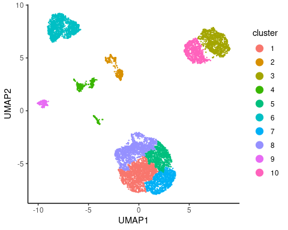
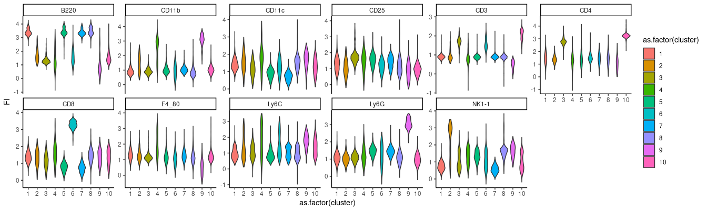
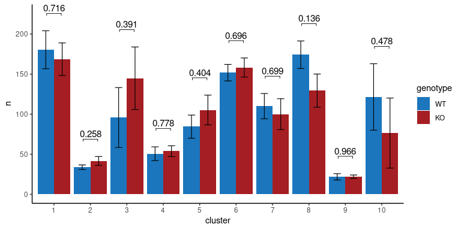

Analysis flow cytometry data - spleens at steady-state
================
Kaspar Bresser
20/10/2021

-   [Import and prep data](#import-and-prep-data)
-   [UMAP](#umap)
-   [Compare cluster frequencies](#compare-cluster-frequencies)

Below the unbiased flow analysis of spleen samples from QPCTL-WT and
QPCTL-KO mice.

Import the necessary packages

## Import and prep data

Read in the fcs files using the
[flowCore](https://bioconductor.org/packages/release/bioc/html/flowCore.html)
package.

``` r
fset <- read.flowSet( path = here("Data", "spleen") )

fset
```

    ## A flowSet with 10 experiments.
    ## 
    ## column names(22): FSC-A FSC-H ... FJComp-YG[E] 585_15-A Time

Down-sample to 1000 cells from each file.

``` r
set.seed(667)

dsFilt <- sampleFilter(size = 1000, filterId="dsFilter")
filter.result <- flowCore::filter(fset, dsFilt)
fset <- Subset(fset, filter.result)
```

We’ll perform a logicle transformation to the fluorescence channels. We
can use 1 sample to calculate the transformation, and then apply it to
all the rest.

``` r
toTrans <- as.character(grep(pattern = "FJ", x = colnames(fset), value = T ))
toTrans
```

    ##  [1] "FJComp-BL[A] 685_35-A" "FJComp-BL[B] 525_50-A" "FJComp-R[A] 780_60-A" 
    ##  [4] "FJComp-R[B] 710_50-A"  "FJComp-R[C] 670_14-A"  "FJComp-UV[A] 819_44-A"
    ##  [7] "FJComp-UV[B] 740_35-A" "FJComp-UV[E] 379_34-A" "FJComp-V[A] 780_60-A" 
    ## [10] "FJComp-V[B] 710_50-A"  "FJComp-V[C] 450_50-A"  "FJComp-YG[A] 780_60-A"
    ## [13] "FJComp-YG[C] 670_30-A" "FJComp-YG[D] 610_20-A" "FJComp-YG[E] 585_15-A"

``` r
lgcl <- estimateLogicle(fset@frames$`export_20191014 Phenotyping QPCTL KO_M8_Spleen_CD45+.fcs`, channels =  toTrans)
trans.fset <- transform(fset, lgcl)
```

Finally, extract to a long dataframe. Use idInfo argument extracts
shorthand sample name from fcs file name, see documentation for details.
Also, add a cell_id column.

``` r
trans.fset %>%  
  flowSet2LongDf( idInfo = list("Sample" = "export_20191014 Phenotyping QPCTL KO_|_Spleen_CD45\\+\\.fcs")) %>% 
  rownames_to_column("cell_id") %>% 
  as_tibble() -> flow.data

flow.data
```

    ## # A tibble: 10,000 × 25
    ##    cell_id  FSC.A FSC.H  FSC.W  SSC.A SSC.H  SSC.W FJComp.BL.A..685_35.A
    ##    <chr>    <dbl> <dbl>  <dbl>  <dbl> <dbl>  <dbl>                 <dbl>
    ##  1 1       66219. 58476 74214. 21894. 19658 72989.                  1.02
    ##  2 2       46876. 37859 81144. 34715. 30615 74313.                  1.85
    ##  3 3       66563. 56705 76929. 21586. 19511 72504.                  1.06
    ##  4 4       70122. 60907 75451. 26790. 24783 70844.                  1.09
    ##  5 5       55246. 47963 75488. 24217. 22421 70785.                  1.26
    ##  6 6       75023. 67805 72513. 31058. 27575 73814.                  1.23
    ##  7 7       70004. 63625 72106. 25253. 23669 69921.                  1.32
    ##  8 8       56919. 48941 76219. 36292. 33436 71133.                  1.38
    ##  9 9       36855  35112 68789. 36752. 36534 65927.                  1.14
    ## 10 10      62690. 55644 73835. 27276. 23720 75360.                  1.03
    ## # … with 9,990 more rows, and 17 more variables: FJComp.BL.B..525_50.A <dbl>,
    ## #   FJComp.R.A..780_60.A <dbl>, FJComp.R.B..710_50.A <dbl>,
    ## #   FJComp.R.C..670_14.A <dbl>, FJComp.UV.A..819_44.A <dbl>,
    ## #   FJComp.UV.B..740_35.A <dbl>, FJComp.UV.E..379_34.A <dbl>,
    ## #   FJComp.V.A..780_60.A <dbl>, FJComp.V.B..710_50.A <dbl>,
    ## #   FJComp.V.C..450_50.A <dbl>, FJComp.YG.A..780_60.A <dbl>,
    ## #   FJComp.YG.C..670_30.A <dbl>, FJComp.YG.D..610_20.A <dbl>, …

And save dataframe for later use.

``` r
write_tsv(flow.data, here("Output", "spleen_data.tsv"))
```

## UMAP

Lets subset the data for the markers that we want to use for the UMAP.

First get the markers available in the dataset

``` r
trans.fset@frames$`export_20191014 Phenotyping QPCTL KO_M10_Spleen_CD45+.fcs`@parameters@data %>% 
  na.omit() %>% 
  pull(desc) -> markers

markers
```

    ##    $P7S    $P8S    $P9S   $P10S   $P12S   $P13S   $P14S   $P15S   $P16S   $P18S 
    ##   "CD8"   "CD3" "F4_80"  "Ly6G"   "CD4"  "B220"  "CD45" "CD11b"  "Ly6C" "NK1-1" 
    ##   $P19S   $P20S   $P21S 
    ##  "7AAD" "CD11c"  "CD25"

Then select markers, drop other columns, and rename according to
proteins

``` r
flow.data %>% 
  dplyr::select(starts_with("FJ"), Sample, cell_id ) %>% 
  dplyr::select(-c(5,11)) %>% # drop channels that were not used
  setNames(., c(markers, "Sample", "cell_id")) %>% # rename columns 
  dplyr::select(!one_of("CD45", "7AAD")) -> flow.data # drop irrelevant markers

flow.data
```

    ## # A tibble: 10,000 × 13
    ##      CD8   CD3 F4_80  Ly6G   CD4  B220 CD11b  Ly6C `NK1-1` CD11c  CD25 Sample
    ##    <dbl> <dbl> <dbl> <dbl> <dbl> <dbl> <dbl> <dbl>   <dbl> <dbl> <dbl> <chr> 
    ##  1  1.02 0.789 1.44  1.62   1.25  3.14 0.835 0.820   0.777 1.12   1.28 M1    
    ##  2  1.85 1.65  1.05  1.16   1.23  1.99 0.962 1.85    0.934 0.955  1.49 M1    
    ##  3  1.06 1.78  1.13  1.17   2.76  1.19 0.875 1.44    0.811 0.908  1.72 M1    
    ##  4  1.09 2.01  0.956 1.03   2.40  1.20 0.923 0.801   1.01  1.35   1.25 M1    
    ##  5  1.26 0.748 1.20  0.874  2.06  3.39 0.882 1.10    1.03  1.95   2.13 M1    
    ##  6  1.23 0.964 1.51  0.774  1.18  3.36 0.759 0.759   1.26  1.13   1.56 M1    
    ##  7  1.32 0.661 1.51  1.16   1.15  3.18 0.727 0.750   0.594 1.49   1.60 M1    
    ##  8  1.38 0.827 1.72  1.21   1.07  3.88 0.897 0.446   1.05  1.46   2.61 M1    
    ##  9  1.14 0.913 2.45  1.57   1.62  1.79 1.07  0.908   1.64  0.706  1.60 M1    
    ## 10  1.03 0.879 1.17  1.28   1.72  3.31 0.799 1.10    1.03  1.03   1.12 M1    
    ## # … with 9,990 more rows, and 1 more variable: cell_id <chr>

Now we can perform the UMAP, and extract the coordinates as a dataframe.

``` r
set.seed(667)

reducU <- umap::umap(flow.data[1:11])

umap_plot_df <- as_tibble(data.frame(reducU$layout))

umap_plot_df
```

    ## # A tibble: 10,000 × 2
    ##          X1     X2
    ##       <dbl>  <dbl>
    ##  1  1.34    -5.93 
    ##  2 -2.87     5.07 
    ##  3  7.76     5.58 
    ##  4  7.75     6.28 
    ##  5 -0.510   -5.12 
    ##  6  0.679   -4.80 
    ##  7 -0.00988 -5.68 
    ##  8  0.215   -4.99 
    ##  9 -4.31    -0.641
    ## 10  1.15    -6.18 
    ## # … with 9,990 more rows

Now use those coordinates to perform hierarchical clustering.

``` r
hc.norm = hclust(dist(umap_plot_df), method = "ward.D")
```

Add a ‘cluster’ column to the flow data, cutting the tree at 10
clusters.

``` r
flow.data$cluster = factor(cutree(hc.norm, 10))
```

Add the coordinates to the flow data and plot the clusters

``` r
flow.data %>% 
  bind_cols(umap_plot_df) %>% 
    ggplot( aes( x = X1, y = X2, color = cluster)) +
      geom_point(size = 0.2) + 
      guides(color = guide_legend(override.aes = list(size = 4)))+
      theme_classic()+
      labs(x = "UMAP1", y = "UMAP2")
```



``` r
ggsave( here("Figs", "Spleen_UMAP_clust.pdf"), width = 4.5, height = 4)
```

Plot the marker expression per cluster.

``` r
flow.data %>% 
  gather("marker", "FI", -c(Sample, cluster, cell_id)) %>% 
    ggplot( aes(x = as.factor(cluster), y = FI, fill = as.factor(cluster)))+
      geom_violin()+
      facet_wrap(~marker, scales = "free_y", nrow = 2)+
      theme_classic()
```



``` r
ggsave(here("Figs", "Spleen_Violin_phenotypes.pdf"), width = 160, height = 40, units = "mm", scale = 2.5)

flow.data %>% 
  bind_cols(umap_plot_df) %>%
  gather("marker", "FI", -c(Sample, cluster, cell_id, X1, X2)) %>% 
  rename(UMAP1 = "X1", UMAP2 = "X2") %>% 
  write_tsv(here("Output", "Spleen_marker_expression_clusters.tsv"))
```

## Compare cluster frequencies

Next we can compare the cell counts of each sample to see if any
phenotypes are enriched in WT or KO mice.

Start off with counting cells in each cluster and add a genotype column.

``` r
## Calculate statistics for the WT and KO cells in each cluster
flow.data %>% 
  count(cluster, Sample ) %>% # count amount of cells from each sample per cluster
  mutate(genotype = factor(case_when(Sample %in% c('M4', 'M5', 'M6_spleen_CD45+.fcs', 'M8', 'M10') ~ "WT",
                                     TRUE ~ "KO"), levels = c('WT', 'KO') ) ) -> cell.counts

cell.counts
```

    ## # A tibble: 99 × 4
    ##    cluster Sample                  n genotype
    ##    <fct>   <chr>               <int> <fct>   
    ##  1 1       M1                    249 KO      
    ##  2 1       M10                   132 WT      
    ##  3 1       M2                    142 KO      
    ##  4 1       M3                    148 KO      
    ##  5 1       M4                    152 WT      
    ##  6 1       M5                    198 WT      
    ##  7 1       M6_spleen_CD45+.fcs   265 WT      
    ##  8 1       M7_spleen_CD45+.fcs   160 KO      
    ##  9 1       M8                    155 WT      
    ## 10 1       M9                    144 KO      
    ## # … with 89 more rows

Then calculate statistics. Perform a T test and add bonferroni
correction

``` r
cell.counts %>% 
  group_by(cluster) %>% # we want to test per cluster
  t_test(n ~ genotype ) %>%
  adjust_pvalue(method = "bonferroni") %>%
  add_significance("p.adj") %>% 
  add_xy_position(fun = "mean_se", x = "cluster", dodge = 0.8) %>% # x-position has to dodge around cluster
  mutate(p.adj = round(p.adj, 4))  -> stat.test

stat.test
```

    ## # A tibble: 10 × 16
    ##    cluster .y.   group1 group2    n1    n2 statistic    df     p p.adj
    ##    <fct>   <chr> <chr>  <chr>  <int> <int>     <dbl> <dbl> <dbl> <dbl>
    ##  1 1       n     WT     KO         5     5    0.378   7.82 0.716     1
    ##  2 2       n     WT     KO         5     5   -1.25    5.97 0.258     1
    ##  3 3       n     WT     KO         5     5   -0.907   7.99 0.391     1
    ##  4 4       n     WT     KO         5     5   -0.293   7.57 0.778     1
    ##  5 5       n     WT     KO         5     5   -0.883   7.56 0.404     1
    ##  6 6       n     WT     KO         5     5   -0.405   7.84 0.696     1
    ##  7 7       n     WT     KO         5     5    0.401   7.69 0.699     1
    ##  8 8       n     WT     KO         5     5    1.66    7.74 0.136     1
    ##  9 9       n     WT     KO         5     5   -0.0445  6.06 0.966     1
    ## 10 10      n     WT     KO         4     5    0.749   6.94 0.478     1
    ## # … with 6 more variables: p.adj.signif <chr>, y.position <dbl>,
    ## #   groups <named list>, x <dbl>, xmin <dbl>, xmax <dbl>

And visualize as bar chart.

``` r
ggplot(cell.counts, aes(x = cluster, y = n))+ 
  geom_bar(position = "dodge", stat = "summary", fun = "mean", aes(fill = genotype))+
  stat_summary(color = "black", geom = "errorbar", fun.data = "mean_se", 
               size = 0.4,width = 0.4, position = position_dodge(.9), 
               aes(group = genotype) )+
  stat_pvalue_manual(data = stat.test,  label = "p", 
                     tip.length = 0.01,hide.ns = F, label.size = 4 )+
  scale_fill_manual(values=c("#1B76BD", "#A51E23"))+
  theme_classic()
```



``` r
ggsave(here("Figs", "Spleen_barchart_counts.pdf"), width = 7, height = 4)

write_tsv(cell.counts, here( "Output", "Spleen_cell_counts.tsv"))
```
